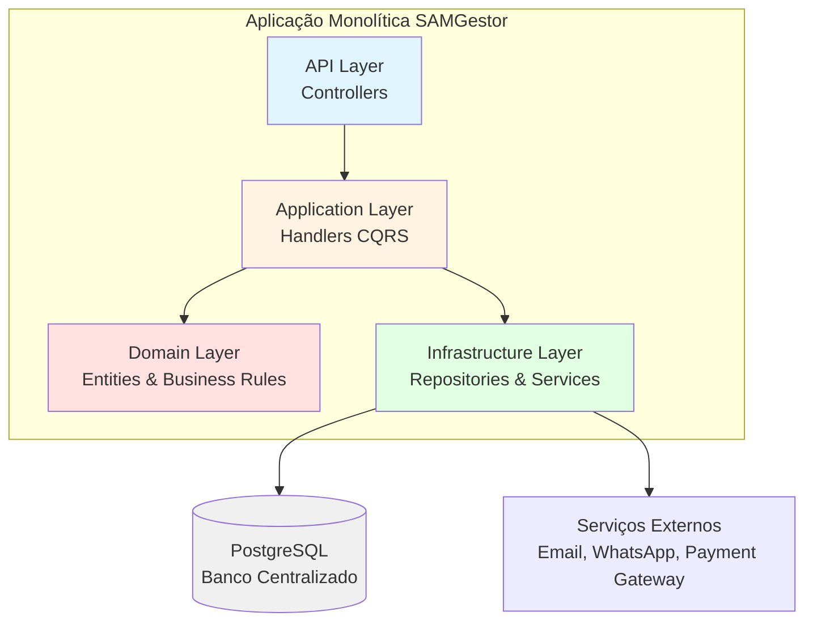
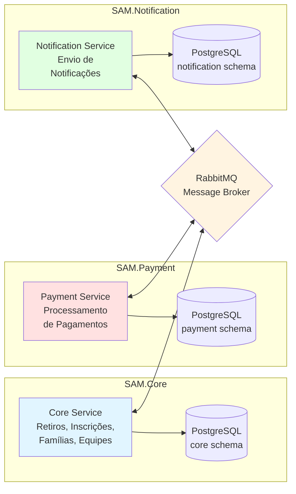
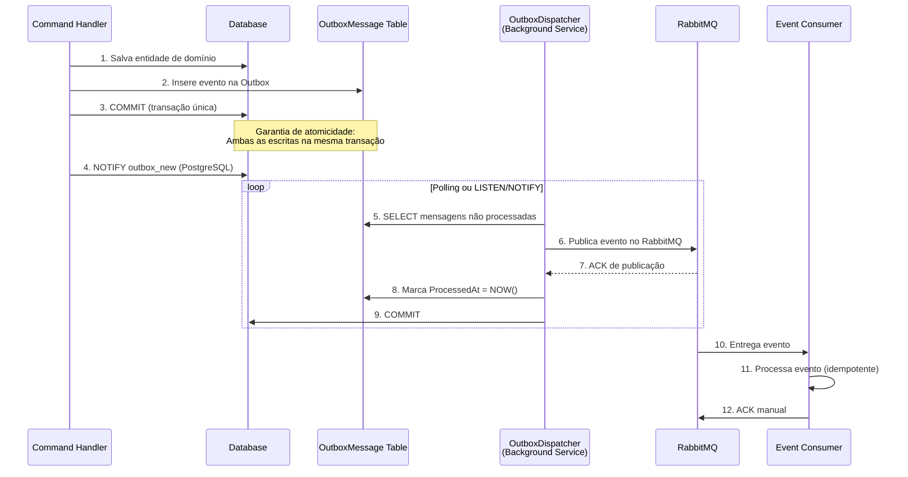
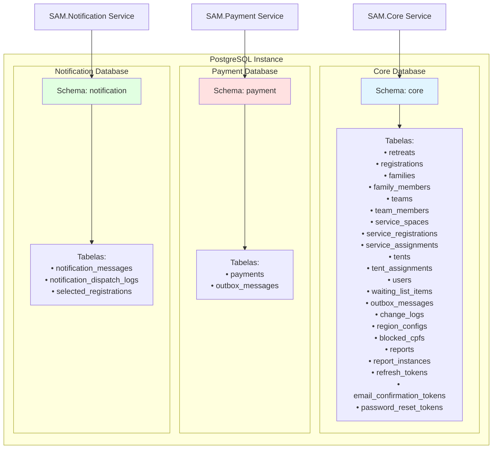

# Arquitetura do Sistema SAMGestor

## 4.1 Proposta Inicial: Arquitetura Monolítica

Na proposta inicial do TCC 1, o sistema SAMGestor foi concebido como uma **arquitetura monolítica** baseada nos princípios de **Clean Architecture**. A aplicação seria estruturada em camadas bem definidas, com separação clara de responsabilidades:

- **Camada de Apresentação (API)**: Controllers REST responsáveis por receber requisições HTTP
- **Camada de Aplicação**: Casos de uso implementados com padrão CQRS usando MediatR
- **Camada de Domínio**: Entidades de negócio, value objects e regras de domínio
- **Camada de Infraestrutura**: Implementações de persistência, mensageria e serviços externos

O sistema utilizaria um **banco de dados centralizado PostgreSQL** contendo todas as entidades do domínio (retiros, inscrições, pagamentos, notificações, famílias, equipes, etc.) em um único schema.

### Diagrama: Arquitetura Monolítica Planejada



## 4.2 Migração para Microserviços

### 4.2.1 Motivação e Justificativa Técnica

Durante o desenvolvimento do TCC 2, foi identificada a necessidade de migrar para uma **arquitetura de microserviços** pelas seguintes razões:

**Justificativas Técnicas:**

1. **Separação de Responsabilidades**: Os módulos de pagamento e notificação possuem ciclos de vida e requisitos distintos do core de negócio
2. **Escalabilidade Independente**: O serviço de notificações pode precisar escalar horizontalmente de forma independente durante períodos de alta demanda
3. **Resiliência**: Falhas no serviço de pagamento ou notificação não devem derrubar todo o sistema
4. **Tecnologia Específica**: Cada serviço pode utilizar bibliotecas e otimizações específicas para seu domínio
5. **Desenvolvimento Paralelo**: Equipes podem trabalhar de forma independente em cada serviço

**Justificativas de Negócio:**

1. **Conformidade e Auditoria**: Isolamento do serviço de pagamentos facilita auditorias e conformidade com regulamentações (PCI-DSS)
2. **Manutenibilidade**: Mudanças em regras de notificação não afetam o core de negócio
3. **Testabilidade**: Cada serviço pode ser testado isoladamente
4. **Deploy Independente**: Atualizações em um serviço não requerem deploy de todo o sistema

### 4.2.2 Análise Comparativa

| Aspecto | Arquitetura Monolítica | Arquitetura de Microserviços |
|---------|------------------------|------------------------------|
| **Deployment** | Deploy único de toda aplicação | Deploy independente por serviço |
| **Escalabilidade** | Escala vertical (toda aplicação) | Escala horizontal por serviço |
| **Falhas/Resiliência** | Falha em um módulo afeta todo sistema | Falhas isoladas por serviço |
| **Comunicação entre módulos** | Chamadas de método diretas (in-process) | Comunicação assíncrona via eventos (RabbitMQ) |
| **Banco de dados** | Banco centralizado único | Database per Service (3 bancos isolados) |
| **Complexidade de desenvolvimento** | Menor (código em um único projeto) | Maior (múltiplos projetos, contratos compartilhados) |
| **Manutenção** | Mudanças podem ter efeitos colaterais amplos | Mudanças isoladas por bounded context |
| **Independência de equipes** | Equipes trabalham no mesmo código | Equipes podem trabalhar independentemente |

## 4.3 Arquitetura de Microserviços Implementada

### 4.3.1 Visão Geral

O sistema SAMGestor foi decomposto em **três microserviços principais**, cada um com seu próprio banco de dados e responsabilidades bem definidas:



### 4.3.2 Serviço Core (SAM.Core)

**Responsabilidades:**
- Gerenciamento de retiros espirituais
- Inscrições de participantes
- Gestão de famílias e grupos familiares
- Gestão de equipes de serviço
- Alocação de barracas (tents)
- Controle de vagas e lista de espera
- Autenticação e autorização de usuários
- Geração de relatórios

**Bounded Context:**
O serviço Core representa o **contexto central de negócio** do sistema, responsável por todas as regras relacionadas à organização e gestão de retiros espirituais.

**Principais Entidades de Domínio:**
- `Retreat`: Retiro espiritual com datas, capacidade e configurações
- `Registration`: Inscrição de participante em um retiro
- `Family`: Família/grupo de participantes
- `FamilyMember`: Vínculo entre inscrição e família
- `Team`: Equipe de serviço
- `TeamMember`: Membro de equipe
- `ServiceSpace`: Espaço de serviço disponível
- `ServiceRegistration`: Inscrição para serviço
- `ServiceAssignment`: Alocação de participante em espaço de serviço
- `Tent`: Barraca disponível no retiro
- `TentAssignment`: Alocação de participante em barraca
- `User`: Usuário do sistema
- `WaitingListItem`: Item da lista de espera
- `OutboxMessage`: Mensagens pendentes para publicação

**Banco de Dados (Core DB):**
- Schema: `core`
- Tabelas principais: `retreats`, `registrations`, `families`, `family_members`, `teams`, `team_members`, `service_spaces`, `service_registrations`, `service_assignments`, `tents`, `tent_assignments`, `users`, `waiting_list_items`, `outbox_messages`

### 4.3.3 Serviço de Pagamentos (SAM.Payment)

**Responsabilidades:**
- Criação de links de pagamento
- Processamento de confirmações de pagamento
- Integração com gateways de pagamento (Mercado Pago, PIX)
- Rastreamento de status de pagamentos
- Publicação de eventos de pagamento confirmado

**Bounded Context:**
O serviço Payment é responsável por todo o **ciclo de vida financeiro** das inscrições, desde a geração do link de pagamento até a confirmação.

**Fluxo de Processamento de Pagamentos:**
1. Recebe evento `PaymentRequestedV1` do serviço Notification
2. Cria registro de pagamento no banco local
3. Gera link de pagamento (fake ou integração real)
4. Publica evento `PaymentLinkCreatedV1` via Outbox
5. Recebe confirmação de pagamento (webhook ou simulação)
6. Atualiza status do pagamento para `Paid`
7. Publica evento `PaymentConfirmedV1` via Outbox

**Principais Entidades:**
- `Payment`: Entidade de pagamento com status, valores, provider e links

**Banco de Dados (Payment DB):**
- Schema: `payment`
- Tabelas principais: `payments`, `outbox_messages`

### 4.3.4 Serviço de Notificações (SAM.Notification)

**Responsabilidades:**
- Recepção de eventos de seleção de participantes
- Envio de emails transacionais
- Criação de grupos do WhatsApp para famílias
- Envio de notificações sobre links de pagamento
- Gerenciamento de templates de mensagens
- Orquestração do fluxo: seleção → pagamento → notificação

**Bounded Context:**
O serviço Notification é responsável por toda **comunicação externa** com participantes e pela **orquestração do fluxo de seleção e pagamento**.

**Canais de Notificação Suportados:**
- **Email**: Envio via SMTP para notificações transacionais
- **WhatsApp**: Criação de grupos familiares (integração futura)

**Principais Entidades:**
- `NotificationMessage`: Mensagem de notificação com canal, destinatário e conteúdo
- `NotificationDispatchLog`: Log de tentativas de envio
- `SelectedRegistration`: Registro de participante selecionado (cache local)

**Banco de Dados (Notification DB):**
- Schema: `notification`
- Tabelas principais: `notification_messages`, `notification_dispatch_logs`, `selected_registrations`

## 4.4 Comunicação Entre Serviços

### 4.4.1 Event-Driven Architecture

O sistema SAMGestor utiliza uma **arquitetura orientada a eventos (Event-Driven Architecture)** para comunicação entre microserviços. Neste modelo:

- **Desacoplamento**: Serviços não conhecem uns aos outros diretamente
- **Assincronicidade**: Comunicação não-bloqueante via mensagens
- **Escalabilidade**: Múltiplos consumidores podem processar eventos em paralelo
- **Auditoria**: Todos os eventos são rastreáveis via `traceId`
- **Resiliência**: Falhas temporárias são tratadas com retry automático

**Padrões Utilizados:**
- **Publisher/Subscriber**: Serviços publicam eventos e outros serviços se inscrevem
- **Event Sourcing Parcial**: Eventos são armazenados antes da publicação (Outbox Pattern)
- **Idempotência**: Consumidores garantem processamento idempotente de eventos

### 4.4.2 RabbitMQ como Message Broker

O **RabbitMQ** foi escolhido como message broker pela sua robustez, suporte a padrões avançados de roteamento e facilidade de configuração.

**Configuração do RabbitMQ:**

```mermaid
graph TB
    subgraph "Publishers"
        CORE_PUB[Core Service]
        PAY_PUB[Payment Service]
        NOT_PUB[Notification Service]
    end

    subgraph "RabbitMQ"
        EX[Exchange: sam.topic<br/>Type: Topic]

        Q1[Queue: notification.selection]
        Q2[Queue: notification.serving]
        Q3[Queue: payment.requested]
        Q4[Queue: core.payment.serving]
        Q5[Queue: notification.payment.link]
        Q6[Queue: notification.payment.confirmed]
        Q7[Queue: notification.familygroups.create]
        Q8[Queue: notification.familygroups.notify]
        Q9[Queue: core.familygroups.created]
        Q10[Queue: core.familygroups.failed]
    end

    subgraph "Consumers"
        NOT_CONS[Notification Service]
        PAY_CONS[Payment Service]
        CORE_CONS[Core Service]
    end

    CORE_PUB -->|selection.participant.selected.v1| EX
    CORE_PUB -->|serving.participant.selected.v1| EX
    CORE_PUB -->|family.group.create.requested.v1| EX
    CORE_PUB -->|family.group.notify.requested.v1| EX

    NOT_PUB -->|payment.requested.v1| EX
    NOT_PUB -->|family.group.created.v1| EX
    NOT_PUB -->|family.group.create.failed.v1| EX

    PAY_PUB -->|payment.link.created.v1| EX
    PAY_PUB -->|payment.confirmed.v1| EX

    EX -->|selection.participant.selected.v1| Q1
    EX -->|serving.participant.selected.v1| Q2
    EX -->|payment.requested.v1| Q3
    EX -->|payment.confirmed.v1| Q4
    EX -->|payment.link.created.v1| Q5
    EX -->|payment.confirmed.v1| Q6
    EX -->|family.group.create.requested.v1| Q7
    EX -->|family.group.notify.requested.v1| Q8
    EX -->|family.group.created.v1| Q9
    EX -->|family.group.create.failed.v1| Q10

    Q1 --> NOT_CONS
    Q2 --> NOT_CONS
    Q3 --> PAY_CONS
    Q4 --> CORE_CONS
    Q5 --> NOT_CONS
    Q6 --> NOT_CONS
    Q7 --> NOT_CONS
    Q8 --> NOT_CONS
    Q9 --> CORE_CONS
    Q10 --> CORE_CONS

    style EX fill:#fff4e1
    style CORE_PUB fill:#e1f5ff
    style PAY_PUB fill:#ffe1e1
    style NOT_PUB fill:#e1ffe1
```



**Detalhes da Configuração:**

- **Exchange**: `sam.topic` (tipo Topic, durável)
- **Routing Keys**: Seguem padrão semântico `<dominio>.<entidade>.<acao>.v<versao>`
- **Queues**: Todas são duráveis (sobrevivem a reinicializações)
- **Prefetch**: Configurado para 10 mensagens por consumidor
- **Delivery Mode**: Persistent (mensagens são persistidas em disco)
- **Acknowledgment**: Manual (consumidor confirma após processamento bem-sucedido)

**Configurações de Retry e Dead Letter:**
Atualmente o sistema não implementa Dead Letter Queues (DLQ). Mensagens com falha permanecem na tabela Outbox com `ProcessedAt = null` e são reprocessadas no próximo ciclo do OutboxDispatcher.

### 4.4.3 Outbox Pattern Implementado

O **Outbox Pattern** é um padrão de design que garante a **consistência eventual** entre o banco de dados local e o message broker, evitando o problema de "dual write" (escrever em dois sistemas transacionais simultaneamente).

**Diagrama do Fluxo Completo:**



**Como Funciona o Padrão Outbox:**

1. **Escrita Transacional**: Quando um handler precisa publicar um evento, ele NÃO publica diretamente no RabbitMQ
2. **Persistência Local**: O evento é serializado e inserido na tabela `outbox_messages` na **mesma transação** que altera as entidades de domínio
3. **Atomicidade Garantida**: Se a transação falhar, nem a entidade nem o evento são persistidos
4. **Processamento Assíncrono**: Um background service (`OutboxDispatcher`) lê periodicamente mensagens pendentes
5. **Publicação no Broker**: O dispatcher publica as mensagens no RabbitMQ
6. **Marcação de Processamento**: Após publicação bem-sucedida, a mensagem é marcada com `ProcessedAt`

**Serviços que Implementam Outbox:**

- ✅ **SAM.Core**: Implementa Outbox completo com suporte a LISTEN/NOTIFY do PostgreSQL
- ✅ **SAM.Payment**: Implementa Outbox com polling simples
- ❌ **SAM.Notification**: Publica eventos diretamente no RabbitMQ (sem Outbox)

**Estrutura da Tabela OutboxMessage:**

| Coluna | Tipo | Descrição |
|--------|------|-----------|
| `Id` | UUID | Identificador único da mensagem |
| `Type` | VARCHAR(200) | Routing key do evento (ex: `payment.confirmed.v1`) |
| `Source` | VARCHAR(100) | Serviço de origem (ex: `sam.core`, `sam.payment`) |
| `TraceId` | VARCHAR(100) | ID de rastreamento para correlação |
| `Data` | TEXT/JSONB | Payload completo do evento serializado em JSON |
| `CreatedAt` | TIMESTAMP | Data/hora de criação |
| `ProcessedAt` | TIMESTAMP (nullable) | Data/hora de publicação (NULL = pendente) |
| `Attempts` | INTEGER | Número de tentativas de publicação |
| `LastError` | TEXT (nullable) | Última mensagem de erro (se houver) |

**Como o OutboxDispatcher Funciona:**

**No SAM.Core:**
- **Modo Polling**: Consulta a cada 10 segundos por mensagens pendentes (configurável)
- **Modo LISTEN/NOTIFY**: Utiliza recurso nativo do PostgreSQL para ser notificado instantaneamente quando uma nova mensagem é inserida
- **Batch Size**: Processa até 50 mensagens por ciclo (configurável)
- **Watchdog**: Em modo LISTEN, executa polling a cada 30 segundos como fallback

**No SAM.Payment:**
- **Modo Polling**: Consulta a cada 2 segundos por mensagens pendentes
- **Batch Size**: Processa até 50 mensagens por ciclo

**Como é Garantida a Entrega dos Eventos:**

1. **At-Least-Once Delivery**: Mensagens podem ser reprocessadas em caso de falha
2. **Retry Automático**: Mensagens com falha permanecem com `ProcessedAt = null` e são retentadas
3. **Persistência**: Mensagens são persistidas antes da publicação
4. **Transação Separada**: A marcação de `ProcessedAt` ocorre após confirmação do RabbitMQ

**Como é Garantida a Idempotência:**

1. **Chaves de Idempotência**: Consumidores usam campos como `RegistrationId`, `PaymentId` para detectar duplicatas
2. **Upsert Pattern**: Consumidores fazem `SingleOrDefaultAsync` antes de criar novas entidades
3. **Status Checks**: Verificam status atual antes de aplicar mudanças (ex: não marcar como pago se já está pago)
4. **Correlation IDs**: Uso de `TraceId` para rastreamento e detecção de duplicatas


### 4.4.4 Eventos de Domínio

A tabela abaixo lista todos os eventos de domínio utilizados no sistema SAMGestor:

| Nome do Evento | Serviço que Publica | Serviço(s) que Consomem | Principais Campos do Payload |
|----------------|---------------------|-------------------------|------------------------------|
| `selection.participant.selected.v1` | **Core** | **Notification** | `RegistrationId`, `RetreatId`, `Amount`, `Currency`, `Name`, `Email`, `Phone` |
| `selection.participant.selected.v2` | **Core** | *(reservado para uso futuro)* | *(não implementado)* |
| `serving.participant.selected.v1` | **Core** | **Notification** | `RegistrationId`, `RetreatId`, `Amount`, `Currency`, `Name`, `Email`, `Phone` |
| `payment.requested.v1` | **Notification** | **Payment** | `RegistrationId`, `RetreatId`, `Amount`, `Currency`, `Name`, `Email`, `Phone` |
| `payment.link.created.v1` | **Payment** | **Notification** | `PaymentId`, `RegistrationId`, `RetreatId`, `Amount`, `Currency`, `LinkUrl`, `ExpiresAt` |
| `payment.confirmed.v1` | **Payment** | **Core**, **Notification** | `PaymentId`, `RegistrationId`, `RetreatId`, `Amount`, `Method`, `PaidAt` |
| `family.group.create.requested.v1` | **Core** | **Notification** | `RetreatId`, `FamilyId`, `ForceRecreate`, `Members[]` (array de `RegistrationId`, `Name`, `Email`, `PhoneE164`) |
| `family.group.created.v1` | **Notification** | **Core** | `RetreatId`, `FamilyId`, `Channel`, `Link`, `ExternalId`, `CreatedAt` |
| `family.group.create.failed.v1` | **Notification** | **Core** | `RetreatId`, `FamilyId`, `Channel`, `Reason`, `AffectedRegistrationIds[]` |
| `family.group.notify.requested.v1` | **Core** | **Notification** | `RetreatId`, `FamilyId`, `GroupLink`, `Members[]` (array de `RegistrationId`, `Name`, `Email`, `PhoneE164`) |
| `notification.email.sent.v1` | **Notification** | *(nenhum - auditoria)* | `NotificationId`, `RegistrationId`, `Email`, `SentAt` |
| `notification.email.failed.v1` | **Notification** | *(nenhum - auditoria)* | `NotificationId`, `RegistrationId`, `Email`, `Error`, `FailedAt` |

**Fluxos de Eventos Principais:**

**Fluxo 1: Seleção de Participante para Retiro**
```
Core → selection.participant.selected.v1 → Notification
Notification → payment.requested.v1 → Payment
Payment → payment.link.created.v1 → Notification (envia email com link)
Payment → payment.confirmed.v1 → Core (atualiza status)
Payment → payment.confirmed.v1 → Notification (envia email de confirmação)
```

**Fluxo 2: Seleção de Participante para Serviço**
```
Core → serving.participant.selected.v1 → Notification
Notification → payment.requested.v1 → Payment
Payment → payment.link.created.v1 → Notification (envia email com link)
Payment → payment.confirmed.v1 → Core (atualiza status e auto-aloca em espaço)
```

**Fluxo 3: Criação de Grupo Familiar no WhatsApp**
```
Core → family.group.create.requested.v1 → Notification
Notification → family.group.created.v1 → Core (atualiza link do grupo)
OU
Notification → family.group.create.failed.v1 → Core (marca como falha)
```

## 4.5 Estratégia de Dados (Database per Service)

O sistema SAMGestor implementa o padrão **Database per Service**, onde cada microserviço possui seu próprio banco de dados isolado. Esta abordagem garante:

- **Autonomia**: Cada serviço controla seu próprio schema
- **Isolamento**: Mudanças no schema de um serviço não afetam outros
- **Escalabilidade**: Bancos podem ser escalados independentemente
- **Tecnologia Específica**: Cada serviço pode usar o SGBD mais adequado (todos usam PostgreSQL atualmente)

### Diagrama: Três Bancos PostgreSQL Isolados



### Core Database (Schema: `core`)

**Entidades/Tabelas Principais:**

**Gestão de Retiros:**
- `retreats`: Retiros espirituais com datas, capacidade, preços e configurações
- `region_configs`: Configurações regionais (estados, cidades permitidas)

**Inscrições e Participantes:**
- `registrations`: Inscrições de participantes em retiros
- `waiting_list_items`: Lista de espera quando retiro está lotado
- `blocked_cpfs`: CPFs bloqueados do sistema

**Famílias:**
- `families`: Grupos familiares com capacidade e link do grupo WhatsApp
- `family_members`: Vínculo entre inscrições e famílias (com posição)

**Equipes de Serviço:**
- `teams`: Equipes de trabalho no retiro
- `team_members`: Membros das equipes

**Espaços de Serviço:**
- `service_spaces`: Espaços de serviço disponíveis (cozinha, limpeza, etc.)
- `service_registrations`: Inscrições para serviço
- `service_assignments`: Alocação de participantes em espaços de serviço
- `service_registration_payments`: Vínculo entre inscrição de serviço e pagamento

**Barracas:**
- `tents`: Barracas disponíveis no retiro
- `tent_assignments`: Alocação de participantes em barracas

**Autenticação:**
- `users`: Usuários do sistema (administradores)
- `refresh_tokens`: Tokens de refresh para autenticação
- `email_confirmation_tokens`: Tokens para confirmação de email
- `password_reset_tokens`: Tokens para reset de senha

**Auditoria e Relatórios:**
- `change_logs`: Log de alterações no sistema
- `reports`: Catálogo de relatórios disponíveis
- `report_instances`: Instâncias de relatórios gerados

**Mensageria:**
- `outbox_messages`: Eventos pendentes para publicação no RabbitMQ
- `message_templates`: Templates de mensagens (legado)
- `messages_sent`: Mensagens enviadas (legado)

### Payment Database (Schema: `payment`)

**Entidades/Tabelas Principais:**

- **`payments`**: Tabela central do serviço de pagamentos
  - Campos: `Id`, `RegistrationId`, `RetreatId`, `Amount`, `Currency`, `Provider`, `ProviderPreferenceId`, `ProviderPaymentId`, `LinkUrl`, `Status`, `CreatedAt`, `UpdatedAt`, `PaidAt`, `ExpiresAt`
  - Status possíveis: `Pending`, `LinkCreated`, `Paid`, `Failed`, `Expired`
  - Índice único em `RegistrationId` para garantir idempotência (1 pagamento por inscrição)

- **`outbox_messages`**: Eventos pendentes para publicação
  - Mesma estrutura do Core, mas com `Source = "sam.payment"`

### Notification Database (Schema: `notification`)

**Entidades/Tabelas Principais:**

- **`notification_messages`**: Mensagens de notificação a serem enviadas
  - Campos: `Id`, `Channel`, `Status`, `RecipientName`, `RecipientEmail`, `RecipientPhone`, `TemplateKey`, `Subject`, `Body`, `RegistrationId`, `RetreatId`, `ExternalCorrelationId`, `Attempts`, `LastError`, `CreatedAt`, `SentAt`
  - Canais: `Email`, `SMS`, `WhatsApp`
  - Status: `Pending`, `Sent`, `Failed`

- **`notification_dispatch_logs`**: Log de tentativas de envio
  - Campos: `Id`, `NotificationMessageId`, `Status`, `Error`, `CreatedAt`

- **`selected_registrations`**: Cache local de participantes selecionados
  - Campos: `RegistrationId` (PK), `RetreatId`, `Name`, `Email`, `Phone`, `Amount`, `Currency`, `Kind`, `CreatedAt`, `UpdatedAt`
  - `Kind`: `Selection` (retiro) ou `Serving` (serviço)
  - Utilizado para idempotência e para evitar chamadas ao Core

### Como é Mantida a Consistência Entre os Bancos

A consistência entre os bancos de dados é mantida através de **Consistência Eventual** via eventos:

1. **Eventos como Fonte da Verdade**: Mudanças de estado são comunicadas via eventos
2. **Idempotência**: Consumidores processam eventos de forma idempotente
3. **Reconciliação**: Serviços mantêm caches locais (ex: `selected_registrations`) sincronizados via eventos
4. **Sem Transações Distribuídas**: Não há uso de 2PC (Two-Phase Commit)
5. **Compensação**: Em caso de falha, eventos de compensação são publicados (ex: `family.group.create.failed.v1`)

**Exemplo de Fluxo com Consistência Eventual:**

1. Core seleciona participante → publica `selection.participant.selected.v1`
2. Notification recebe evento → salva em `selected_registrations` → publica `payment.requested.v1`
3. Payment recebe evento → cria `payment` → publica `payment.link.created.v1`
4. Payment confirma pagamento → publica `payment.confirmed.v1`
5. Core recebe evento → atualiza `registration` com status pago
6. Notification recebe evento → envia email de confirmação

**Desafios e Soluções:**

| Desafio | Solução Implementada |
|---------|---------------------|
| Duplicação de dados | Cache local mínimo (ex: `selected_registrations`) |
| Sincronização | Eventos com `TraceId` para rastreamento |
| Falhas de comunicação | Outbox Pattern + Retry automático |
| Inconsistências temporárias | Aceitável (consistência eventual) |
| Queries cross-service | Evitadas; cada serviço tem dados necessários |

---

## Conclusão

A arquitetura de microserviços implementada no SAMGestor demonstra a evolução de um sistema monolítico para uma solução distribuída, escalável e resiliente. A utilização de padrões como **Outbox Pattern**, **Event-Driven Architecture** e **Database per Service** garante:

- ✅ **Desacoplamento entre serviços**: Cada serviço opera de forma independente
- ✅ **Escalabilidade independente**: Serviços podem escalar conforme demanda específica
- ✅ **Resiliência a falhas**: Falhas isoladas não comprometem todo o sistema
- ✅ **Consistência eventual garantida**: Eventos asseguram sincronização entre serviços
- ✅ **Rastreabilidade completa**: Todos os eventos possuem `TraceId` para auditoria
- ✅ **Facilidade de manutenção**: Mudanças isoladas por bounded context
- ✅ **Testabilidade**: Cada serviço pode ser testado independentemente

Esta arquitetura serve como base sólida para futuras expansões do sistema, como:

- Adição de novos canais de notificação (SMS, Push Notifications)
- Integração com múltiplos gateways de pagamento (Mercado Pago, Stripe, PayPal)
- Implementação de analytics e relatórios avançados
- Criação de serviço de auditoria centralizado
- Implementação de API Gateway para roteamento unificado
- Adição de circuit breakers e políticas de retry avançadas

A documentação apresentada neste documento fornece uma visão completa da arquitetura implementada, servindo como referência técnica para o desenvolvimento contínuo do sistema SAMGestor.

