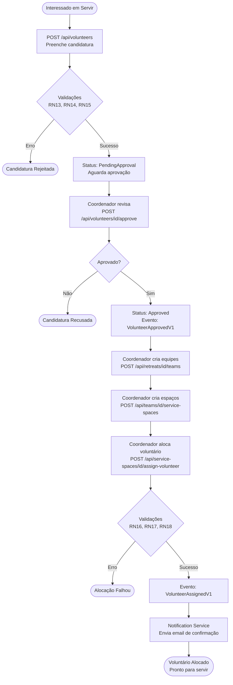

# CAPÍTULO 7 - FUNCIONALIDADES IMPLEMENTADAS

## 7.1 Gestão de Retiros

A gestão de retiros constitui a funcionalidade central do sistema SAMGestor, permitindo que administradores criem, configurem e gerenciem eventos espirituais de forma completa. Esta seção descreve como o sistema resolve a necessidade de centralizar todas as informações e operações relacionadas a um retiro espiritual.

### 7.1.1 Criação e Configuração de Retiros

O administrador inicia a gestão de um novo retiro através do endpoint principal de criação:

**Endpoint:** `POST /api/retreats`

**Payload de Request:**
```json
{
  "name": "Retiro SAM 2024 - Edição Primavera",
  "description": "Retiro espiritual para jovens e adultos",
  "startDate": "2024-11-15T14:00:00Z",
  "endDate": "2024-11-17T16:00:00Z",
  "location": "Chácara Santo Antônio - Assis/SP",
  "maxParticipants": 120,
  "registrationStartDate": "2024-09-01T00:00:00Z",
  "registrationEndDate": "2024-10-31T23:59:59Z",
  "price": 150.00,
  "category": "Male"
}
```

**Payload de Response:**
```json
{
  "id": "3fa85f64-5717-4562-b3fc-2c963f66afa6",
  "name": "Retiro SAM 2024 - Edição Primavera",
  "status": "Draft",
  "createdAt": "2024-09-01T10:30:00Z",
  "maxParticipants": 120,
  "currentParticipants": 0,
  "availableSlots": 120
}
```

O sistema aplica as seguintes regras de negócio durante a criação:

- **RN1:** A data de início deve ser posterior à data de término das inscrições
- **RN2:** A capacidade máxima deve ser maior que zero e múltipla de 4 (para formação de famílias)
- **RN3:** O período de inscrições deve anteceder o início do retiro em pelo menos 7 dias
- **RN4:** O nome do retiro deve ser único no sistema

### 7.1.2 Configuração de Cotas Regionais

Para garantir diversidade geográfica, o sistema permite configurar cotas regionais através do endpoint:

**Endpoint:** `POST /api/retreats/{id}/region-configs`

**Payload de Request:**
```json
{
  "westRegionPercentage": 50,
  "otherRegionsPercentage": 50,
  "westRegionCities": [
    "Assis", "Presidente Prudente", "Marília", "Ourinhos"
  ]
}
```

Esta configuração é fundamental para o algoritmo de contemplação (Seção 7.4), garantindo que 50% das vagas sejam destinadas a participantes da região Oeste e 50% para outras regiões.

### 7.1.3 Operações de Gestão

O sistema oferece endpoints completos para gerenciamento do ciclo de vida do retiro:

- **GET /api/retreats:** Lista todos os retiros com filtros (status, data, categoria)
- **GET /api/retreats/{id}:** Obtém detalhes completos de um retiro específico
- **PUT /api/retreats/{id}:** Atualiza informações do retiro (apenas se status = Draft)
- **DELETE /api/retreats/{id}:** Remove retiro (apenas se não houver inscrições)
- **POST /api/retreats/{id}/publish:** Publica retiro e abre inscrições públicas
- **POST /api/retreats/{id}/cancel:** Cancela retiro e notifica todos os inscritos

### 7.1.4 Validações Implementadas

O sistema implementa validações automáticas que protegem a integridade dos dados:

- **Validação de Datas:** Impede criação de retiros com datas inconsistentes
- **Validação de Capacidade:** Alerta quando inscrições ultrapassam 90% da capacidade
- **Validação de Status:** Bloqueia edições em retiros já publicados ou finalizados
- **Validação de Janela de Inscrição:** Impede inscrições fora do período configurado (RN9)

## 7.2 Fluxo de Participação (Fazer o Retiro)

O fluxo de participação representa a jornada completa de um participante desde a inscrição inicial até a confirmação final de sua presença no retiro. Esta seção descreve cada etapa do processo end-to-end, demonstrando como o sistema orquestra múltiplos microserviços para proporcionar uma experiência fluida e automatizada.

### 7.2.1 Inscrição Pública

O processo inicia quando um interessado acessa o formulário público de inscrição. O sistema captura informações essenciais através do endpoint:

**Endpoint:** `POST /api/registrations`

**Payload de Request:**
```json
{
  "retreatId": "3fa85f64-5717-4562-b3fc-2c963f66afa6",
  "fullName": "João da Silva Santos",
  "cpf": "123.456.789-00",
  "email": "joao.silva@email.com",
  "phone": "(18) 99876-5432",
  "birthDate": "1995-03-15",
  "gender": "Male",
  "city": "Assis",
  "state": "SP",
  "address": "Rua das Flores, 123",
  "emergencyContact": "Maria Silva - (18) 98765-4321",
  "termsAccepted": true
}
```

**Payload de Response:**
```json
{
  "id": "7c9e6679-7425-40de-944b-e07fc1f90ae7",
  "registrationNumber": "SAM2024-001",
  "status": "PendingSelection",
  "createdAt": "2024-09-15T14:30:00Z",
  "message": "Inscrição realizada com sucesso! Aguarde o resultado do sorteio."
}
```

O sistema aplica as seguintes validações durante a inscrição:

- **RN5:** Termos de uso devem ser aceitos (termsAccepted = true)
- **RN8:** CPF deve ser único por retiro (não permite inscrições duplicadas)
- **RN9:** Inscrição só é aceita dentro da janela configurada
- **RN11:** CPF não pode estar na lista de bloqueados
- **RN12:** Participante deve ter idade mínima de 16 anos

Após a validação bem-sucedida, o sistema publica o evento `RegistrationCreatedV1` para notificar outros serviços.

### 7.2.2 Upload de Foto 3x4

Complementando a inscrição, o participante deve enviar uma foto 3x4 que será utilizada no crachá:

**Endpoint:** `POST /api/registrations/{id}/photo`

**Request:** Multipart/form-data com arquivo de imagem

O sistema valida:
- Formato aceito: JPG, PNG
- Tamanho máximo: 2MB
- Proporção recomendada: 3:4

A foto é armazenada no serviço de Storage e o link é vinculado à inscrição.

### 7.2.3 Contemplação no Sorteio

Após o encerramento das inscrições, o administrador executa o sorteio de contemplação:

**Endpoint:** `POST /api/retreats/{id}/lottery/commit`

O algoritmo de sorteio (detalhado na Seção 7.4) seleciona participantes respeitando as cotas configuradas. Para cada participante selecionado:

1. Status da inscrição muda de `PendingSelection` para `Selected`
2. Sistema publica evento `SelectionParticipantSelectedV1`
3. Data de seleção é registrada

**Evento Publicado:**
```json
{
  "eventType": "SelectionParticipantSelectedV1",
  "eventId": "uuid",
  "timestamp": "2024-11-01T10:00:00Z",
  "data": {
    "registrationId": "7c9e6679-7425-40de-944b-e07fc1f90ae7",
    "retreatId": "3fa85f64-5717-4562-b3fc-2c963f66afa6",
    "participantName": "João da Silva Santos",
    "participantEmail": "joao.silva@email.com",
    "retreatName": "Retiro SAM 2024 - Edição Primavera",
    "retreatStartDate": "2024-11-15T14:00:00Z",
    "retreatEndDate": "2024-11-17T16:00:00Z"
  }
}
```

### 7.2.4 Notificação de Seleção

O serviço **Notification** consome o evento `SelectionParticipantSelectedV1` e envia automaticamente um email ao participante selecionado:

**Conteúdo do Email:**
- Parabéns pela seleção
- Informações detalhadas do retiro (datas, local, horários)
- Próximos passos: aguardar link de pagamento
- Prazo para confirmação de pagamento

### 7.2.5 Geração de Pagamento

Simultaneamente, o serviço **Payment** também consome o evento `SelectionParticipantSelectedV1` e executa as seguintes ações:

**Endpoint Interno:** `POST /api/payments/create-from-selection`

1. Cria registro de pagamento no banco de dados
2. Gera link de checkout (fake em desenvolvimento, MercadoPago em produção)
3. Define prazo de vencimento (7 dias após seleção)
4. Publica evento `PaymentLinkCreatedV1`

**Evento Publicado:**
```json
{
  "eventType": "PaymentLinkCreatedV1",
  "eventId": "uuid",
  "timestamp": "2024-11-01T10:05:00Z",
  "data": {
    "paymentId": "pay_123456",
    "registrationId": "7c9e6679-7425-40de-944b-e07fc1f90ae7",
    "participantEmail": "joao.silva@email.com",
    "amount": 150.00,
    "checkoutUrl": "https://payment.samgestor.com/checkout/pay_123456",
    "dueDate": "2024-11-08T23:59:59Z"
  }
}
```

### 7.2.6 Envio de Link de Pagamento

O serviço **Notification** consome o evento `PaymentLinkCreatedV1` e envia um segundo email ao participante:

**Conteúdo do Email:**
- Link direto para checkout
- Valor a pagar (R$ 150,00)
- Prazo de vencimento
- Instruções de pagamento
- Alerta: vaga será liberada se não pagar no prazo

### 7.2.7 Confirmação de Pagamento

Quando o participante efetua o pagamento através do gateway (MercadoPago ou simulador fake):

**Endpoint Webhook:** `POST /api/payments/webhook`

O serviço Payment processa o webhook e:

1. Valida autenticidade da notificação
2. Atualiza status do pagamento para `Confirmed`
3. Publica evento `PaymentConfirmedV1`

**Evento Publicado:**
```json
{
  "eventType": "PaymentConfirmedV1",
  "eventId": "uuid",
  "timestamp": "2024-11-02T15:30:00Z",
  "data": {
    "paymentId": "pay_123456",
    "registrationId": "7c9e6679-7425-40de-944b-e07fc1f90ae7",
    "amount": 150.00,
    "paidAt": "2024-11-02T15:30:00Z"
  }
}
```

### 7.2.8 Atualização de Status e Confirmação Final

O serviço **Core** consome o evento `PaymentConfirmedV1` e:

1. Atualiza status da inscrição de `Selected` para `PaymentConfirmed`
2. Registra data de confirmação
3. Incrementa contador de participantes confirmados do retiro

O serviço **Notification** também consome o evento e envia email final de confirmação:

**Conteúdo do Email:**
- Confirmação de pagamento recebido
- Instruções finais para o retiro
- O que levar (roupas, itens pessoais)
- Informações de transporte e chegada
- Contatos para dúvidas


### 7.2.9 Resumo do Fluxo de Participação

O fluxo completo demonstra a orquestração entre três microserviços (Core, Payment, Notification) através de eventos assíncronos, proporcionando uma experiência automatizada e consistente. As regras de negócio RN5, RN8, RN9, RN11 e RN12 são aplicadas durante a inscrição, garantindo a integridade dos dados desde o início do processo.

## 7.3 Fluxo de Voluntariado (Servir no Retiro)

O fluxo de voluntariado permite que pessoas interessadas em servir durante o retiro se candidatem a posições específicas em equipes de trabalho. Esta seção descreve como o sistema gerencia desde a candidatura até a alocação final em espaços de serviço.

### 7.3.1 Candidatura para Voluntariado

O interessado em servir inicia o processo através do endpoint de candidatura:

**Endpoint:** `POST /api/volunteers`

**Payload de Request:**
```json
{
  "retreatId": "3fa85f64-5717-4562-b3fc-2c963f66afa6",
  "fullName": "Maria Santos Silva",
  "cpf": "987.654.321-00",
  "email": "maria.santos@email.com",
  "phone": "(18) 98765-4321",
  "birthDate": "1990-05-20",
  "gender": "Female",
  "city": "Presidente Prudente",
  "state": "SP",
  "previousExperience": true,
  "numberOfRetreatsServed": 3,
  "preferredTeams": ["Cozinha", "Limpeza"],
  "availability": "FullWeekend",
  "observations": "Tenho experiência em cozinha industrial"
}
```

**Payload de Response:**
```json
{
  "id": "vol-456789",
  "volunteerNumber": "VOL2024-015",
  "status": "PendingApproval",
  "createdAt": "2024-09-20T10:00:00Z",
  "message": "Candidatura recebida! Aguarde aprovação da coordenação."
}
```

O sistema aplica validações:

- **RN13:** CPF deve ser único por retiro (não pode ser voluntário e participante simultaneamente)
- **RN14:** Voluntário deve ter idade mínima de 18 anos
- **RN15:** Janela de candidatura deve estar aberta

### 7.3.2 Aprovação de Voluntários

O coordenador revisa as candidaturas e aprova através do endpoint:

**Endpoint:** `POST /api/volunteers/{id}/approve`

**Payload de Request:**
```json
{
  "approvedBy": "coord-123",
  "notes": "Voluntária experiente, aprovada para equipe de cozinha"
}
```

O status muda de `PendingApproval` para `Approved`, e o sistema publica evento `VolunteerApprovedV1`.

### 7.3.3 Criação de Equipes e Espaços de Serviço

O administrador cria equipes de trabalho e seus respectivos espaços:

**Endpoint:** `POST /api/retreats/{id}/teams`

**Payload de Request:**
```json
{
  "name": "Equipe de Cozinha",
  "description": "Responsável por preparar todas as refeições",
  "coordinatorId": "coord-123",
  "maxVolunteers": 8,
  "requiredSkills": ["Cozinha", "Higiene Alimentar"]
}
```

**Endpoint:** `POST /api/teams/{id}/service-spaces`

**Payload de Request:**
```json
{
  "name": "Cozinha Principal",
  "description": "Preparo de refeições principais",
  "location": "Bloco A - Térreo",
  "capacity": 4,
  "shift": "Morning"
}
```

### 7.3.4 Alocação de Voluntários em Espaços

O coordenador aloca voluntários aprovados em espaços de serviço:

**Endpoint:** `POST /api/service-spaces/{id}/assign-volunteer`

**Payload de Request:**
```json
{
  "volunteerId": "vol-456789",
  "role": "Auxiliar de Cozinha",
  "shift": "Morning"
}
```

O sistema valida:

- **RN16:** Espaço não pode exceder capacidade máxima
- **RN17:** Voluntário não pode estar alocado em múltiplos espaços no mesmo turno
- **RN18:** Voluntário deve estar com status `Approved`

### 7.3.5 Notificações aos Voluntários

Após alocação, o sistema publica evento `VolunteerAssignedV1` e o serviço Notification envia email:

**Conteúdo do Email:**
- Confirmação de alocação
- Equipe e espaço de serviço designados
- Horários de trabalho
- Instruções específicas da equipe
- Contato do coordenador

### 7.3.6 Gestão de Escalas

O sistema permite visualizar escalas completas:

**Endpoint:** `GET /api/retreats/{id}/schedules`

**Response:**
```json
{
  "teams": [
    {
      "teamName": "Equipe de Cozinha",
      "coordinator": "João Coordenador",
      "serviceSpaces": [
        {
          "spaceName": "Cozinha Principal",
          "shift": "Morning",
          "volunteers": [
            {
              "name": "Maria Santos Silva",
              "role": "Auxiliar de Cozinha",
              "phone": "(18) 98765-4321"
            }
          ]
        }
      ]
    }
  ]
}
```


## 7.4 Contemplação (Sorteio com Cotas)

O algoritmo de contemplação é uma das funcionalidades mais críticas do sistema, garantindo um processo de seleção justo e transparente que respeita cotas regionais e de gênero. Esta seção detalha como o sistema implementa o sorteio com preview e confirmação.

### 7.4.1 Objetivo do Sorteio

O sorteio visa selecionar participantes de forma aleatória, mas respeitando critérios de diversidade:

- **Diversidade Regional:** 50% das vagas para região Oeste, 50% para outras regiões
- **Equilíbrio de Gênero:** 50% masculino, 50% feminino
- **Transparência:** Permitir preview antes de confirmar definitivamente
- **Flexibilidade:** Possibilitar ajustes manuais após sorteio automático

### 7.4.2 Configuração de Cotas

Antes de executar o sorteio, o administrador deve configurar as cotas regionais:

**Endpoint:** `POST /api/retreats/{id}/region-configs`

**Payload de Request:**
```json
{
  "westRegionPercentage": 50,
  "otherRegionsPercentage": 50,
  "westRegionCities": [
    "Assis", "Presidente Prudente", "Marília", "Ourinhos",
    "Rancharia", "Cândido Mota", "Paraguaçu Paulista"
  ]
}
```

Esta configuração é armazenada e utilizada pelo algoritmo de sorteio. O sistema valida que a soma dos percentuais seja exatamente 100%.

### 7.4.3 Algoritmo de Sorteio

O algoritmo implementado segue os seguintes passos:

**Passo 1: Separação por Região**
- Busca todas as inscrições com status `PendingSelection`
- Separa em dois grupos: Região Oeste vs Outras Regiões
- Utiliza a lista de cidades configurada para classificação

**Passo 2: Separação por Gênero**
- Dentro de cada grupo regional, separa por gênero (Male/Female)
- Resulta em 4 grupos: Oeste-Masculino, Oeste-Feminino, Outras-Masculino, Outras-Feminino

**Passo 3: Cálculo de Vagas por Grupo**
- Total de vagas: 120 (exemplo)
- Vagas Oeste: 60 (50%)
- Vagas Outras: 60 (50%)
- Vagas Oeste-Masculino: 30 (25% do total)
- Vagas Oeste-Feminino: 30 (25% do total)
- Vagas Outras-Masculino: 30 (25% do total)
- Vagas Outras-Feminino: 30 (25% do total)

**Passo 4: Sorteio Aleatório**
- Para cada grupo, embaralha aleatoriamente as inscrições
- Seleciona as primeiras N inscrições (onde N = vagas calculadas)
- Utiliza algoritmo Fisher-Yates para embaralhamento justo

**Passo 5: Validação de Cotas**
- Verifica se as cotas foram atingidas
- Gera alertas se houver inscrições insuficientes em algum grupo
- Permite ajustes manuais se necessário

### 7.4.4 Preview do Sorteio

Antes de confirmar, o administrador pode visualizar o resultado do sorteio:

**Endpoint:** `GET /api/retreats/{id}/lottery/preview`

**Response:**
```json
{
  "totalSlots": 120,
  "selectedCount": 120,
  "statistics": {
    "westRegion": {
      "total": 60,
      "male": 30,
      "female": 30,
      "percentage": 50.0
    },
    "otherRegions": {
      "total": 60,
      "male": 30,
      "female": 30,
      "percentage": 50.0
    },
    "genderDistribution": {
      "male": 60,
      "female": 60,
      "malePercentage": 50.0,
      "femalePercentage": 50.0
    }
  },
  "selectedParticipants": [
    {
      "id": "reg-001",
      "name": "João da Silva",
      "city": "Assis",
      "region": "West",
      "gender": "Male"
    }
  ],
  "warnings": []
}
```

O preview **NÃO persiste** as seleções no banco de dados, permitindo múltiplas execuções até o resultado desejado.

### 7.4.5 Alertas do Preview

O sistema gera alertas quando detecta problemas:

**Alerta: Cotas Não Atingidas**
```json
{
  "type": "QuotaNotMet",
  "severity": "Warning",
  "message": "Região Oeste - Feminino: apenas 25 inscrições disponíveis, mas cota requer 30",
  "affectedQuota": "WestFemale",
  "required": 30,
  "available": 25
}
```

**Alerta: Inscrições Insuficientes**
```json
{
  "type": "InsufficientRegistrations",
  "severity": "Error",
  "message": "Total de inscrições (100) é menor que vagas disponíveis (120)",
  "totalRegistrations": 100,
  "totalSlots": 120
}
```

### 7.4.6 Confirmação do Sorteio (Commit)

Após revisar o preview e fazer ajustes manuais se necessário, o administrador confirma o sorteio:

**Endpoint:** `POST /api/retreats/{id}/lottery/commit`

**Response:**
```json
{
  "success": true,
  "selectedCount": 120,
  "eventsPublished": 120,
  "message": "Sorteio confirmado com sucesso! Notificações serão enviadas aos selecionados."
}
```

O commit executa as seguintes ações em uma **transação ACID** com isolamento serializável:

1. Atualiza status de todas as inscrições selecionadas para `Selected`
2. Registra data/hora da seleção
3. Publica evento `SelectionParticipantSelectedV1` para cada selecionado
4. Marca o sorteio como confirmado (impede nova execução)

A transação garante que ou todas as seleções são persistidas, ou nenhuma é (atomicidade).

### 7.4.7 Seleção e Deseleção Manual

O sistema permite ajustes manuais após o sorteio automático:

**Endpoint:** `POST /api/retreats/{id}/lottery/select/{registrationId}`

Seleciona manualmente um participante específico. O sistema valida:
- **RN24:** Não pode exceder o número máximo de vagas do retiro
- **RN6:** Participante deve estar com status `PendingSelection` ou `NotSelected`
- **RN7:** Retiro não pode estar finalizado

**Endpoint:** `POST /api/retreats/{id}/lottery/unselect/{registrationId}`

Remove seleção de um participante. O sistema valida:
- Participante deve estar com status `Selected`
- Sorteio não pode estar confirmado (committed)

Esses endpoints são úteis para casos especiais, como:
- Substituir participante que desistiu
- Corrigir erro no sorteio automático
- Adicionar participante por critério especial (ex: membro da organização)


## 7.5 Gestão de Famílias

A gestão de famílias espirituais é uma funcionalidade essencial do sistema SAMGestor, permitindo a formação de grupos de acolhimento compostos por quatro participantes. Esta seção descreve como o sistema automatiza a criação de famílias respeitando critérios de diversidade e validações de negócio.

### 7.5.1 Conceito de Família Espiritual

Uma família espiritual no contexto do retiro SAM é composta por:

- **Composição:** Exatamente 4 participantes (2 homens/padrinhos + 2 mulheres/madrinhas)
- **Critérios de Formação:** Idades próximas (diferença máxima recomendada de 10 anos), cidades diferentes (para promover diversidade), sobrenomes diferentes (para evitar parentesco)
- **Objetivo:** Proporcionar acolhimento, suporte emocional e espiritual durante o retiro

### 7.5.2 Geração Automática de Famílias

O sistema oferece um algoritmo inteligente para geração automática de famílias:

**Endpoint:** `POST /api/retreats/{id}/families/generate`

**Payload de Request:**
```json
{
  "maxAgeDifference": 10,
  "prioritizeDifferentCities": true,
  "strictSurnameValidation": true
}
```

**Algoritmo de Geração:**

**Passo 1: Filtragem de Participantes**
- Busca todos os participantes com status `PaymentConfirmed`
- Exclui participantes já alocados em famílias
- Separa por gênero (Masculino e Feminino)

**Passo 2: Agrupamento por Faixa Etária**
- Calcula idade de cada participante
- Agrupa em faixas: 16-20, 21-25, 26-30, 31-35, 36-40, 41+
- Prioriza combinações dentro da mesma faixa ou faixas adjacentes

**Passo 3: Formação de Combinações**
- Para cada faixa etária, tenta formar famílias com 2M + 2F
- Valida sobrenomes diferentes (RN17 - bloqueante)
- Verifica cidades diferentes (RN10 - alerta, mas permite)
- Calcula diferença de idade entre membros (RN11 - alerta se > 10 anos)

**Passo 4: Validação e Criação**
- Valida cada família formada
- Cria registros no banco de dados
- Retorna estatísticas e alertas

**Response:**
```json
{
  "familiesCreated": 28,
  "participantsAllocated": 112,
  "participantsRemaining": 8,
  "warnings": [
    {
      "familyId": "fam-005",
      "type": "SameCity",
      "message": "Família 005: 2 membros da mesma cidade (Assis)"
    },
    {
      "familyId": "fam-012",
      "type": "AgeDifference",
      "message": "Família 012: diferença de idade de 12 anos entre membros"
    }
  ]
}
```

### 7.5.3 Validações e Alertas

O sistema implementa validações rigorosas durante a formação de famílias:

**Validações Bloqueantes (ERRO):**

- **RN8:** Exatamente 2 homens e 2 mulheres
```json
{
  "error": "InvalidFamilyComposition",
  "message": "Família deve ter exatamente 2 homens e 2 mulheres",
  "currentComposition": { "male": 3, "female": 1 }
}
```

- **RN16:** Mínimo de 4 membros
```json
{
  "error": "InsufficientMembers",
  "message": "Família deve ter no mínimo 4 membros",
  "currentMembers": 3
}
```

- **RN17:** Sobrenomes diferentes (evita parentes na mesma família)
```json
{
  "error": "DuplicateSurname",
  "message": "Família não pode ter membros com mesmo sobrenome",
  "duplicatedSurname": "Silva",
  "affectedMembers": ["João Silva", "Maria Silva"]
}
```

**Alertas Não-Bloqueantes (WARNING):**

- **RN10:** Membros da mesma cidade
```json
{
  "warning": "SameCityMembers",
  "message": "2 membros são da mesma cidade: Assis",
  "severity": "Low"
}
```

- **RN11:** Diferença de idade superior a 10 anos
```json
{
  "warning": "AgeDifferenceExceeded",
  "message": "Diferença de idade entre membros: 12 anos",
  "minAge": 18,
  "maxAge": 30,
  "severity": "Medium"
}
```

### 7.5.4 Criação Manual de Famílias

Além da geração automática, o sistema permite criação manual:

**Endpoint:** `POST /api/retreats/{id}/families`

**Payload de Request:**
```json
{
  "name": "Família Esperança",
  "memberIds": [
    "reg-001",
    "reg-045",
    "reg-078",
    "reg-112"
  ]
}
```

O sistema valida todas as regras (RN8, RN16, RN17) e retorna erros ou alertas conforme necessário.

### 7.5.5 Criação de Grupos WhatsApp

Para facilitar a comunicação entre membros da família, o sistema oferece integração com WhatsApp:

**Endpoint:** `POST /api/families/{id}/whatsapp-group`

**Payload de Request:**
```json
{
  "groupName": "Família Esperança - Retiro SAM 2024"
}
```

O sistema publica evento `FamilyGroupCreateRequestedV1`:

```json
{
  "eventType": "FamilyGroupCreateRequestedV1",
  "eventId": "uuid",
  "timestamp": "2024-11-05T10:00:00Z",
  "data": {
    "familyId": "fam-001",
    "groupName": "Família Esperança - Retiro SAM 2024",
    "members": [
      {
        "name": "João Silva",
        "phone": "+5518998765432"
      },
      {
        "name": "Maria Santos",
        "phone": "+5518987654321"
      }
    ]
  }
}
```

O serviço **Notification** consome o evento e:
1. Cria grupo no WhatsApp (via API Business)
2. Adiciona todos os membros
3. Envia mensagem de boas-vindas
4. Retorna link do grupo

**Response:**
```json
{
  "success": true,
  "groupId": "whatsapp-group-123",
  "groupLink": "https://chat.whatsapp.com/ABC123XYZ",
  "membersAdded": 4
}
```

### 7.5.6 Operações CRUD de Famílias

O sistema oferece endpoints completos para gestão:

**Listar Famílias:**
**Endpoint:** `GET /api/retreats/{id}/families?page=1&pageSize=20&hasWarnings=true`

**Response:**
```json
{
  "totalCount": 28,
  "page": 1,
  "pageSize": 20,
  "items": [
    {
      "id": "fam-001",
      "name": "Família Esperança",
      "members": [
        {
          "name": "João Silva",
          "age": 25,
          "city": "Assis",
          "gender": "Male"
        }
      ],
      "hasWarnings": true,
      "warnings": ["SameCity"],
      "whatsappGroupCreated": true
    }
  ]
}
```

**Atualizar Família:**
**Endpoint:** `PUT /api/retreats/{id}/families/{familyId}`

**Remover Família:**
**Endpoint:** `DELETE /api/retreats/{id}/families/{familyId}`

Validação: Só permite remoção se retiro não estiver finalizado.


## 7.6 Gestão de Barracas

A gestão de barracas é fundamental para organizar a acomodação física dos participantes durante o retiro. O sistema oferece funcionalidades completas para criação, alocação e monitoramento de ocupação das barracas.

### 7.6.1 Conceito de Barraca

As barracas no sistema SAMGestor representam:

- **Acomodações Físicas:** Espaços onde participantes dormem durante o retiro
- **Segregação por Gênero:** Barracas exclusivamente Masculinas ou Femininas
- **Capacidade Configurável:** Cada barraca tem capacidade máxima (ex: 4, 6, 8 pessoas)
- **Identificação:** Número ou nome único para facilitar localização

### 7.6.2 Criação de Barracas

O administrador cria barracas individualmente ou em lote:

**Endpoint:** `POST /api/retreats/{id}/tents`

**Payload de Request (Criação Individual):**
```json
{
  "number": "B01",
  "name": "Barraca Masculina 01",
  "category": "Male",
  "maxCapacity": 6,
  "location": "Área A - Setor Norte"
}
```

**Endpoint:** `POST /api/retreats/{id}/tents/bulk`

**Payload de Request (Criação em Lote):**
```json
{
  "prefix": "BM",
  "category": "Male",
  "quantity": 15,
  "maxCapacity": 6,
  "location": "Área A - Setor Norte"
}
```

Este endpoint cria 15 barracas automaticamente: BM01, BM02, ..., BM15.

**Response:**
```json
{
  "tentsCreated": 15,
  "totalCapacity": 90,
  "category": "Male"
}
```

### 7.6.3 Alocação Automática de Participantes

O sistema oferece algoritmo inteligente para alocar participantes em barracas:

**Endpoint:** `POST /api/retreats/{id}/tents/auto-assign`

**Algoritmo de Alocação:**

**Passo 1: Filtragem**
- Busca participantes com status `PaymentConfirmed`
- Exclui participantes já alocados em barracas
- Separa por gênero (Male/Female)

**Passo 2: Ordenação de Barracas**
- Lista barracas da categoria correspondente
- Ordena por ocupação atual (menor para maior)
- Prioriza barracas com menor ocupação

**Passo 3: Alocação**
- Para cada participante, busca primeira barraca com vaga disponível
- Valida capacidade máxima (RN23)
- Valida compatibilidade de gênero (RN15)
- Cria vínculo participante → barraca

**Response:**
```json
{
  "participantsAllocated": 112,
  "tentsUsed": 19,
  "remainingParticipants": 8,
  "occupancyRate": 92.5,
  "warnings": [
    {
      "tentId": "tent-005",
      "type": "Underutilized",
      "message": "Barraca BM05 com apenas 2 ocupantes (capacidade: 6)"
    }
  ]
}
```

### 7.6.4 Alocação Manual

Além da alocação automática, o sistema permite alocação manual:

**Endpoint:** `POST /api/tents/{id}/assign-participant`

**Payload de Request:**
```json
{
  "participantId": "reg-001"
}
```

O sistema valida:
- **RN15:** Gênero do participante deve ser compatível com categoria da barraca
- **RN23:** Barraca não pode exceder capacidade máxima
- **RN16:** Participante não pode estar alocado em múltiplas barracas

### 7.6.5 Alertas de Ocupação

O sistema gera alertas automáticos sobre o estado das barracas:

**Alerta: Barraca Cheia (100% ocupada)**
```json
{
  "type": "FullCapacity",
  "severity": "Info",
  "tentId": "tent-001",
  "message": "Barraca BM01 está com capacidade máxima (6/6)"
}
```

**Alerta: Barraca Subutilizada (< 50% ocupada)**
```json
{
  "type": "Underutilized",
  "severity": "Warning",
  "tentId": "tent-005",
  "message": "Barraca BM05 com apenas 2 ocupantes (capacidade: 6)",
  "occupancyRate": 33.3
}
```

**Alerta: Barraca Sem Alocações**
```json
{
  "type": "Empty",
  "severity": "Warning",
  "tentId": "tent-010",
  "message": "Barraca BM10 não possui ocupantes"
}
```

**Erro: Barraca Acima da Capacidade**
```json
{
  "type": "OverCapacity",
  "severity": "Error",
  "tentId": "tent-003",
  "message": "Barraca BM03 excedeu capacidade máxima (7/6)",
  "currentOccupancy": 7,
  "maxCapacity": 6
}
```

### 7.6.6 Operações de Gestão

**Listar Barracas com Ocupação:**
**Endpoint:** `GET /api/retreats/{id}/tents?category=Male&includeOccupancy=true`

**Response:**
```json
{
  "totalCount": 15,
  "items": [
    {
      "id": "tent-001",
      "number": "BM01",
      "category": "Male",
      "maxCapacity": 6,
      "currentOccupancy": 6,
      "occupancyRate": 100.0,
      "status": "Full",
      "participants": [
        {
          "id": "reg-001",
          "name": "João Silva",
          "age": 25
        }
      ]
    }
  ]
}
```

**Remover Participante da Barraca:**
**Endpoint:** `DELETE /api/tents/{tentId}/participants/{participantId}`

**Estatísticas de Barracas:**
**Endpoint:** `GET /api/retreats/{id}/tents/statistics`

**Response:**
```json
{
  "totalTents": 30,
  "maleCategory": {
    "tents": 15,
    "totalCapacity": 90,
    "currentOccupancy": 58,
    "occupancyRate": 64.4
  },
  "femaleCategory": {
    "tents": 15,
    "totalCapacity": 90,
    "currentOccupancy": 54,
    "occupancyRate": 60.0
  },
  "overallOccupancyRate": 62.2,
  "fullTents": 8,
  "emptyTents": 3,
  "underutilizedTents": 5
}
```

## 7.7 Gestão de Equipes e Espaços

A gestão de equipes e espaços de serviço permite organizar os voluntários em grupos de trabalho específicos, garantindo que todas as atividades do retiro sejam cobertas adequadamente.

### 7.7.1 Criação de Equipes

**Endpoint:** `POST /api/retreats/{id}/teams`

**Payload de Request:**
```json
{
  "name": "Equipe de Cozinha",
  "description": "Responsável por preparar todas as refeições do retiro",
  "coordinatorId": "vol-001",
  "maxVolunteers": 12,
  "requiredSkills": ["Cozinha", "Higiene Alimentar"],
  "color": "#FF5733"
}
```

**Response:**
```json
{
  "id": "team-001",
  "name": "Equipe de Cozinha",
  "coordinator": {
    "id": "vol-001",
    "name": "Maria Coordenadora"
  },
  "currentVolunteers": 0,
  "maxVolunteers": 12,
  "serviceSpaces": []
}
```

### 7.7.2 Criação de Espaços de Serviço

Cada equipe pode ter múltiplos espaços de serviço:

**Endpoint:** `POST /api/teams/{id}/service-spaces`

**Payload de Request:**
```json
{
  "name": "Cozinha Principal",
  "description": "Preparo de refeições principais (almoço e jantar)",
  "location": "Bloco A - Térreo",
  "capacity": 6,
  "shift": "AllDay",
  "requiredSkills": ["Cozinha"]
}
```

### 7.7.3 Estatísticas de Equipes

**Endpoint:** `GET /api/retreats/{id}/teams/statistics`

**Response:**
```json
{
  "totalTeams": 8,
  "totalServiceSpaces": 24,
  "totalVolunteersAllocated": 45,
  "teams": [
    {
      "teamName": "Equipe de Cozinha",
      "volunteersAllocated": 10,
      "maxVolunteers": 12,
      "fillRate": 83.3,
      "serviceSpaces": 3,
      "hasCoordinator": true
    }
  ],
  "warnings": [
    {
      "type": "NoCoordinator",
      "teamId": "team-005",
      "message": "Equipe de Limpeza não possui coordenador"
    },
    {
      "type": "EmptyServiceSpace",
      "spaceId": "space-012",
      "message": "Espaço 'Refeitório' não possui voluntários alocados"
    }
  ]
}
```


## 7.8 Dashboards e Relatórios

Os dashboards e relatórios fornecem visões consolidadas e analíticas dos dados do retiro, permitindo que gestores tomem decisões informadas e acompanhem o progresso em tempo real.

### 7.8.1 Dashboard Geral do Retiro

O dashboard principal oferece uma visão panorâmica de todos os aspectos do retiro:

**Endpoint:** `GET /api/retreats/{id}/dashboard/overview`

**Response:**
```json
{
  "retreatInfo": {
    "id": "retreat-001",
    "name": "Retiro SAM 2024 - Edição Primavera",
    "startDate": "2024-11-15T14:00:00Z",
    "endDate": "2024-11-17T16:00:00Z",
    "status": "InProgress"
  },
  "registrations": {
    "total": 250,
    "pendingSelection": 130,
    "selected": 120,
    "paymentConfirmed": 112,
    "notSelected": 130,
    "cancelled": 8
  },
  "participants": {
    "confirmed": 112,
    "male": 56,
    "female": 56,
    "westRegion": 56,
    "otherRegions": 56
  },
  "tents": {
    "total": 30,
    "occupancyRate": 93.3,
    "fullTents": 18,
    "emptyTents": 1
  },
  "families": {
    "total": 28,
    "participantsAllocated": 112,
    "withWarnings": 5,
    "whatsappGroupsCreated": 25
  },
  "teams": {
    "total": 8,
    "volunteersAllocated": 45,
    "serviceSpaces": 24
  },
  "criticalAlerts": [
    {
      "type": "OverCapacityTent",
      "message": "Barraca BM03 excedeu capacidade",
      "severity": "High"
    }
  ]
}
```

Este dashboard é consumido pelo frontend para exibir cards informativos, gráficos e indicadores-chave de desempenho (KPIs).

### 7.8.2 Dashboard de Pagamentos

Fornece visão detalhada sobre a situação financeira do retiro:

**Endpoint:** `GET /api/retreats/{id}/dashboard/payments`

**Response:**
```json
{
  "summary": {
    "totalExpected": 18000.00,
    "totalPaid": 16800.00,
    "totalPending": 1200.00,
    "totalCancelled": 0.00
  },
  "conversionRate": {
    "selectedToConfirmed": 93.3,
    "registeredToSelected": 48.0
  },
  "paymentsByStatus": {
    "confirmed": 112,
    "pending": 8,
    "cancelled": 0,
    "expired": 0
  },
  "defaulters": [
    {
      "registrationId": "reg-045",
      "participantName": "Carlos Oliveira",
      "email": "carlos@email.com",
      "amountDue": 150.00,
      "dueDate": "2024-11-08T23:59:59Z",
      "daysPastDue": 3
    }
  ],
  "revenueByDate": [
    {
      "date": "2024-11-01",
      "amount": 4500.00,
      "paymentsCount": 30
    }
  ]
}
```

### 7.8.3 Dashboard de Famílias

Apresenta estatísticas sobre a formação de famílias espirituais:

**Endpoint:** `GET /api/retreats/{id}/dashboard/families`

**Response:**
```json
{
  "summary": {
    "totalFamilies": 28,
    "participantsAllocated": 112,
    "participantsWithoutFamily": 0,
    "formationRate": 100.0
  },
  "warnings": {
    "sameCityMembers": 3,
    "ageDifferenceExceeded": 2,
    "total": 5
  },
  "whatsappGroups": {
    "created": 25,
    "pending": 3,
    "creationRate": 89.3
  },
  "familiesWithWarnings": [
    {
      "familyId": "fam-005",
      "name": "Família Esperança",
      "warnings": ["SameCity"],
      "members": [
        {
          "name": "João Silva",
          "city": "Assis"
        },
        {
          "name": "Pedro Santos",
          "city": "Assis"
        }
      ]
    }
  ]
}
```

### 7.8.4 Relatórios em PDF

O sistema utiliza a biblioteca **QuestPDF** para gerar relatórios profissionais em formato PDF:

**Endpoint:** `GET /api/retreats/{id}/reports/participants?format=pdf`

**Conteúdo do Relatório:**
- Cabeçalho com logo e informações do retiro
- Lista completa de participantes ordenada por família
- Informações: Nome, CPF, Cidade, Família, Barraca, Equipe
- Rodapé com data de geração e paginação

**Outros Relatórios Disponíveis:**

**Relatório de Famílias:**
**Endpoint:** `GET /api/retreats/{id}/reports/families?format=pdf`

Conteúdo:
- Lista de todas as famílias
- Membros de cada família com foto 3x4
- Informações de contato
- Alertas e observações

**Relatório de Barracas:**
**Endpoint:** `GET /api/retreats/{id}/reports/tents?format=pdf`

Conteúdo:
- Mapa de barracas com ocupação
- Lista de participantes por barraca
- Taxa de ocupação
- Alertas de capacidade

**Relatório de Equipes:**
**Endpoint:** `GET /api/retreats/{id}/reports/teams?format=pdf`

Conteúdo:
- Lista de equipes e coordenadores
- Voluntários alocados por espaço de serviço
- Escalas de trabalho
- Contatos de emergência

### 7.8.5 Exportação de Dados

O sistema permite exportar dados em formatos estruturados:

**Endpoint:** `GET /api/retreats/{id}/export?format=excel`

Formatos suportados:
- **Excel (.xlsx):** Múltiplas planilhas (Participantes, Famílias, Barracas, Equipes)
- **CSV:** Arquivo único com dados tabulares
- **JSON:** Estrutura completa para integração com outros sistemas

## 7.9 Alertas e Validações Automáticas

O sistema implementa um robusto mecanismo de validações e alertas que auxiliam gestores na tomada de decisões e previnem erros operacionais.

### 7.9.1 Validações Bloqueantes (ERRO)

Estas validações impedem a execução da ação e retornam HTTP 400 Bad Request:

**RN5: Termos de Uso Não Aceitos**
```json
{
  "error": "TermsNotAccepted",
  "message": "Participante deve aceitar os termos de uso para se inscrever",
  "field": "termsAccepted"
}
```

**RN8: CPF Duplicado no Retiro**
```json
{
  "error": "DuplicateCpf",
  "message": "CPF 123.456.789-00 já está inscrito neste retiro",
  "existingRegistrationId": "reg-045"
}
```

**RN9: Janela de Inscrição Fechada**
```json
{
  "error": "RegistrationClosed",
  "message": "Período de inscrições encerrado em 31/10/2024",
  "registrationEndDate": "2024-10-31T23:59:59Z"
}
```

**RN11: CPF Bloqueado**
```json
{
  "error": "BlockedCpf",
  "message": "CPF 123.456.789-00 está bloqueado no sistema",
  "reason": "Comportamento inadequado em retiro anterior",
  "blockedAt": "2024-05-15T10:00:00Z"
}
```

**RN16: Família com Composição Inválida**
```json
{
  "error": "InvalidFamilyComposition",
  "message": "Família deve ter exatamente 4 membros (2M + 2F)",
  "currentComposition": { "male": 3, "female": 1 }
}
```

**RN17: Sobrenomes Repetidos na Família**
```json
{
  "error": "DuplicateSurname",
  "message": "Família não pode ter membros com mesmo sobrenome",
  "duplicatedSurname": "Silva",
  "affectedMembers": ["João Silva", "Maria Silva"]
}
```

**RN23: Barraca Acima da Capacidade**
```json
{
  "error": "TentOverCapacity",
  "message": "Barraca BM03 excedeu capacidade máxima",
  "currentOccupancy": 7,
  "maxCapacity": 6
}
```

**RN24: Retiro Acima da Capacidade**
```json
{
  "error": "RetreatOverCapacity",
  "message": "Retiro atingiu capacidade máxima de participantes",
  "currentParticipants": 120,
  "maxParticipants": 120
}
```

### 7.9.2 Alertas Não-Bloqueantes (WARNING)

Estes alertas permitem a ação, mas informam potenciais problemas:

**RN10: Família com Membros da Mesma Cidade**
```json
{
  "warning": "SameCityMembers",
  "message": "2 membros da família são da mesma cidade: Assis",
  "severity": "Low",
  "recommendation": "Considere redistribuir membros para promover diversidade"
}
```

**RN11: Diferença de Idade Elevada**
```json
{
  "warning": "AgeDifferenceExceeded",
  "message": "Diferença de idade entre membros: 12 anos",
  "minAge": 18,
  "maxAge": 30,
  "severity": "Medium",
  "recommendation": "Verifique se a família está confortável com a diferença"
}
```

**Barraca Subutilizada**
```json
{
  "warning": "UnderutilizedTent",
  "message": "Barraca BM05 com apenas 33% de ocupação",
  "currentOccupancy": 2,
  "maxCapacity": 6,
  "severity": "Low"
}
```

**Equipe Sem Coordenador**
```json
{
  "warning": "NoCoordinator",
  "message": "Equipe de Limpeza não possui coordenador designado",
  "teamId": "team-005",
  "severity": "High"
}
```

**Espaço Sem Voluntários**
```json
{
  "warning": "EmptyServiceSpace",
  "message": "Espaço 'Refeitório' não possui voluntários alocados",
  "spaceId": "space-012",
  "severity": "High"
}
```


### 7.9.3 Implementação Técnica das Validações

Todas as validações são implementadas utilizando a biblioteca **FluentValidation** no backend, garantindo consistência e reutilização de regras:

**Pipeline de Validação:**
1. Request chega ao Controller
2. ValidationBehavior intercepta o Command/Query
3. Validador correspondente é executado automaticamente
4. Se houver erros, retorna HTTP 400 com lista estruturada
5. Se válido, prossegue para o Handler

**Exemplo de Resposta de Validação:**
```json
{
  "type": "ValidationError",
  "title": "Um ou mais erros de validação ocorreram",
  "status": 400,
  "errors": {
    "cpf": ["CPF já está inscrito neste retiro"],
    "termsAccepted": ["Você deve aceitar os termos de uso"],
    "birthDate": ["Participante deve ter idade mínima de 16 anos"]
  }
}
```

Este mecanismo garante que todas as regras de negócio sejam aplicadas de forma consistente em todos os endpoints da API.

## 7.10 Funcionalidades Administrativas

O sistema oferece funcionalidades administrativas essenciais para gestão de usuários, permissões e configurações globais.

### 7.10.1 Gestão de Usuários

**Endpoint:** `POST /api/users`

**Payload de Request:**
```json
{
  "fullName": "Admin SAM",
  "email": "admin@samgestor.com",
  "password": "SecurePassword123!",
  "role": "Administrator"
}
```

**Roles Disponíveis:**
- **Administrator:** Acesso total ao sistema
- **Coordinator:** Gerencia retiros, equipes e voluntários
- **Viewer:** Apenas visualização de dados

### 7.10.2 Autenticação e Autorização

**Endpoint de Login:** `POST /api/auth/login`

**Payload de Request:**
```json
{
  "email": "admin@samgestor.com",
  "password": "SecurePassword123!"
}
```

**Response:**
```json
{
  "accessToken": "eyJhbGciOiJIUzI1NiIsInR5cCI6IkpXVCJ9...",
  "refreshToken": "refresh_token_here",
  "expiresIn": 3600,
  "user": {
    "id": "user-001",
    "fullName": "Admin SAM",
    "email": "admin@samgestor.com",
    "role": "Administrator"
  }
}
```

O sistema utiliza **JWT (JSON Web Tokens)** para autenticação stateless, com tokens de acesso de curta duração (1 hora) e refresh tokens de longa duração (7 dias).

### 7.10.3 Gestão de CPFs Bloqueados

Permite bloquear participantes que tiveram comportamento inadequado:

**Endpoint:** `POST /api/blocked-cpfs`

**Payload de Request:**
```json
{
  "cpf": "123.456.789-00",
  "reason": "Comportamento inadequado durante retiro anterior",
  "blockedBy": "admin-001",
  "notes": "Participante foi advertido múltiplas vezes"
}
```

**Endpoint de Desbloqueio:** `DELETE /api/blocked-cpfs/{cpf}`

### 7.10.4 Auditoria e Logs

O sistema registra todas as operações críticas para auditoria:

**Endpoint:** `GET /api/audit-logs?entityType=Retreat&action=Update&startDate=2024-11-01`

**Response:**
```json
{
  "totalCount": 150,
  "items": [
    {
      "id": "log-001",
      "timestamp": "2024-11-05T14:30:00Z",
      "userId": "user-001",
      "userName": "Admin SAM",
      "action": "Update",
      "entityType": "Retreat",
      "entityId": "retreat-001",
      "changes": {
        "maxParticipants": {
          "oldValue": 100,
          "newValue": 120
        }
      },
      "ipAddress": "192.168.1.100"
    }
  ]
}
```

### 7.10.5 Configurações Globais

**Endpoint:** `GET /api/settings`

**Response:**
```json
{
  "system": {
    "applicationName": "SAMGestor",
    "version": "1.0.0",
    "environment": "Production"
  },
  "email": {
    "smtpServer": "smtp.gmail.com",
    "smtpPort": 587,
    "fromEmail": "noreply@samgestor.com",
    "fromName": "Sistema SAMGestor"
  },
  "payment": {
    "provider": "MercadoPago",
    "currency": "BRL",
    "defaultPrice": 150.00
  },
  "notifications": {
    "enableEmailNotifications": true,
    "enableWhatsAppNotifications": true
  }
}
```

**Endpoint de Atualização:** `PUT /api/settings`

### 7.10.6 Marcação de Participante como Concluído

Após o retiro, o gestor marca participantes que completaram o retiro:

**Endpoint:** `POST /api/registrations/{id}/mark-completed`

**Payload de Request:**
```json
{
  "completedAt": "2024-11-17T16:00:00Z",
  "notes": "Participante concluiu todas as atividades com sucesso",
  "certificate": true
}
```

Esta marcação é importante para:
- Gerar certificados de participação
- Histórico do participante
- Estatísticas de conclusão do retiro
- Priorização em retiros futuros

## Resumo do Capítulo

Este capítulo apresentou de forma detalhada as funcionalidades implementadas no sistema SAMGestor, demonstrando como o sistema atende aos requisitos funcionais levantados no Capítulo 5 e materializa a arquitetura proposta no Capítulo 4. As funcionalidades foram descritas do ponto de vista do usuário, focando no que o sistema faz e como resolve problemas reais da organização SAM.

O fluxo completo de participação, desde a inscrição pública até a confirmação de pagamento, demonstra a orquestração eficiente entre os microserviços Core, Payment e Notification através de eventos assíncronos. O sistema automatiza processos que anteriormente eram manuais e propensos a erros, como o sorteio com cotas regionais e de gênero, garantindo transparência e justiça na seleção de participantes.

A gestão automatizada de famílias espirituais, com validações rigorosas de composição e alertas inteligentes, facilita a formação de grupos de acolhimento que promovem diversidade e integração entre participantes de diferentes cidades e faixas etárias. A integração com WhatsApp para criação automática de grupos de família demonstra como o sistema se integra com ferramentas já utilizadas pelos participantes.

O algoritmo de alocação de barracas otimiza o uso do espaço físico disponível, respeitando segregação por gênero e capacidade máxima, enquanto gera alertas sobre barracas subutilizadas ou acima da capacidade. A gestão de equipes e espaços de serviço garante que todas as atividades do retiro sejam cobertas por voluntários qualificados e devidamente alocados.

Os dashboards gerenciais fornecem visões consolidadas e analíticas que permitem aos gestores acompanhar o progresso do retiro em tempo real, identificar problemas rapidamente e tomar decisões informadas. A geração de relatórios em PDF utilizando QuestPDF oferece documentos profissionais para impressão e distribuição física durante o retiro.

O robusto sistema de validações e alertas, implementado com FluentValidation, previne erros operacionais ao bloquear ações inválidas (como CPF duplicado ou barraca acima da capacidade) e alertar sobre situações que merecem atenção (como famílias com membros da mesma cidade). Esta abordagem equilibra segurança com flexibilidade, permitindo que gestores tomem decisões conscientes.

As funcionalidades administrativas, incluindo gestão de usuários, autenticação JWT, bloqueio de CPFs e auditoria completa de operações, garantem segurança, rastreabilidade e controle de acesso adequado ao sistema. A marcação de participantes como concluídos após o retiro permite manter histórico completo e gerar certificados de participação.

A arquitetura de microserviços apresentada no Capítulo 4 e a implementação com Clean Architecture detalhada no Capítulo 6 permitiram construir um sistema robusto, escalável e manutenível que resolve os problemas reais da organização SAM. O sistema não apenas automatiza processos manuais, mas também introduz inteligência e validações que melhoram significativamente a qualidade da gestão de retiros espirituais.

---

## Diagramas de Fluxo

### Diagrama 1: Fluxo do Participante (Fazer o Retiro)


### Diagrama 2: Fluxo do Voluntário (Servir no Retiro)




### Diagrama 3: Fluxo do Gestor (Gerenciamento Completo do Retiro)


### Diagrama 4: Visão Geral da Comunicação entre Microserviços


---

## Considerações Finais

O Capítulo 7 demonstrou que o sistema SAMGestor implementa um conjunto abrangente de funcionalidades que atendem plenamente às necessidades da organização SAM. Cada funcionalidade foi projetada com foco na experiência do usuário, automatização de processos e prevenção de erros, resultando em um sistema que não apenas digitaliza processos manuais, mas também introduz inteligência e validações que melhoram significativamente a qualidade da gestão.

Os diagramas de fluxo apresentados ilustram visualmente como as diferentes funcionalidades se conectam para formar fluxos completos de trabalho, desde a perspectiva do participante, do voluntário e do gestor. A comunicação assíncrona entre microserviços através de eventos garante baixo acoplamento e alta escalabilidade, permitindo que o sistema cresça conforme as necessidades da organização.

A implementação das funcionalidades descritas neste capítulo foi possível graças à sólida arquitetura de microserviços (Capítulo 4), à modelagem de dados bem estruturada (Capítulo 5) e à aplicação rigorosa dos princípios de Clean Architecture (Capítulo 6). O resultado é um sistema robusto, manutenível e preparado para evoluir junto com a organização SAM.
