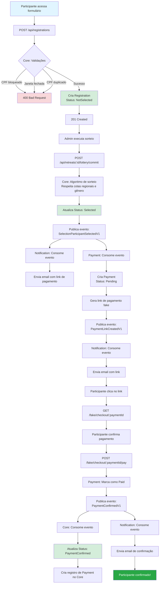

# 6. IMPLEMENTAÇÃO

A implementação do SAMGestor foi conduzida seguindo os princípios de Clean Architecture e Domain-Driven Design (DDD), organizando o sistema em três microserviços independentes mas coesos: Core, Payment e Notification. Esta abordagem arquitetural permitiu a separação clara de responsabilidades, facilitando a manutenção, testabilidade e evolução independente de cada componente do sistema.

O desenvolvimento priorizou a qualidade do código através da aplicação de padrões consolidados como CQRS (Command Query Responsibility Segregation) com MediatR, validações robustas com FluentValidation, e comunicação assíncrona baseada em eventos utilizando RabbitMQ. A infraestrutura foi containerizada com Docker, garantindo consistência entre ambientes de desenvolvimento, homologação e produção.

Um dos principais desafios superados foi a implementação de um sistema de sorteio justo e auditável, que respeita cotas regionais e de gênero, garantindo transações ACID através de isolamento serializável. Outro aspecto crítico foi o design do padrão Outbox para garantir entrega confiável de eventos entre microserviços, evitando inconsistências de dados mesmo em cenários de falha.

## 6.1 Stack Tecnológica e Infraestrutura

O SAMGestor foi construído utilizando tecnologias modernas e consolidadas do ecossistema .NET, priorizando performance, escalabilidade e produtividade no desenvolvimento. A escolha do .NET 8 como plataforma base proporciona suporte de longo prazo (LTS) e recursos avançados de linguagem através do C# 12.

### Principais Tecnologias

| Categoria | Nome | Versão | Finalidade/Uso no Projeto | Serviço(s) |
|-----------|------|--------|---------------------------|------------|
| **Linguagem e Runtime** |
| Runtime | .NET | 8.0 | Plataforma de execução e desenvolvimento | Todos |
| Linguagem | C# | 12 | Linguagem de programação principal | Todos |
| **Banco de Dados** |
| SGBD | PostgreSQL | 16 | Banco de dados relacional principal | Todos |
| Ferramenta Admin | pgAdmin | 8 | Interface web para administração do PostgreSQL | Infraestrutura |
| **Mensageria** |
| Message Broker | RabbitMQ | 3.13 | Comunicação assíncrona entre microserviços | Todos |
| **Containerização** |
| Container Runtime | Docker | - | Containerização de aplicações | Todos |
| Orquestração | Docker Compose | 3.9 | Orquestração de múltiplos containers | Infraestrutura |
| **ORM e Data Access** |
| ORM | Entity Framework Core | 8.0.8 / 9.0.8 | Mapeamento objeto-relacional e migrations | Todos |
| Provider | Npgsql.EntityFrameworkCore.PostgreSQL | 8.0.8 / 9.0.4 | Provider EF Core para PostgreSQL | Todos |
| **Bibliotecas de Aplicação** |
| Mediator | MediatR | 11.1.0 | Implementação de CQRS e padrão Mediator | Core |
| Validação | FluentValidation | 12.0.0 | Validação de comandos e queries | Core |
| Mensageria Client | RabbitMQ.Client | 7.1.2 | Cliente para comunicação com RabbitMQ | Todos |
| Geração PDF | QuestPDF | 2024.10.0 | Geração de relatórios em PDF | Core |
| **Ferramentas de Desenvolvimento** |
| Documentação API | Swagger/Swashbuckle | 6.6.2 / 9.0.4 | Documentação interativa de APIs REST | Todos |
| Email (Dev) | MailHog | latest | Servidor SMTP fake para desenvolvimento | Infraestrutura |
| **Testes** |
| Framework de Testes | xUnit | - | Framework de testes unitários e integração | Core |
| Mocking | Moq | - | Biblioteca para criação de mocks em testes | Core |
| Containers de Teste | Testcontainers | - | Containers Docker para testes de integração | Core |

### Observações sobre Versões

- **Entity Framework Core**: O serviço Core utiliza versão 8.0.8 (alinhada com .NET 8), enquanto Payment e Notification utilizam 9.0.8 (versão mais recente, compatível com .NET 8)
- **Npgsql**: Versões 8.0.8 e 9.0.4 são utilizadas de acordo com a versão do EF Core em cada serviço
- **Swagger**: Core utiliza Swashbuckle 6.6.2, enquanto Payment e Notification utilizam 9.0.4

## 6.2 Estrutura dos Microserviços

Todos os microserviços do SAMGestor seguem os princípios da Clean Architecture, organizando o código em camadas bem definidas que promovem separação de responsabilidades, testabilidade e independência de frameworks externos. A estrutura é consistente entre os serviços, facilitando a navegação e manutenção do código.

### Camadas da Clean Architecture

A arquitetura é organizada em quatro camadas principais, com dependências sempre apontando para dentro (das camadas externas para as internas):

1. **Domain (Domínio)**: Núcleo da aplicação, contém entidades, value objects, enums e interfaces de repositórios. Não possui dependências externas.

2. **Application (Aplicação)**: Contém a lógica de aplicação através de Commands, Queries, Handlers e Validators. Depende apenas da camada de Domain.

3. **Infrastructure (Infraestrutura)**: Implementa detalhes técnicos como acesso a dados, mensageria, email, etc. Depende de Domain e Application.

4. **API (Apresentação)**: Camada de entrada HTTP, contém controllers, middlewares e configurações. Depende de todas as outras camadas.

### Estrutura de Pastas do Serviço Core (SAMGestor)

```
src/
├── SAMGestor.Domain/                    # Camada de Domínio
│   ├── Entities/                        # Entidades de domínio (Aggregates)
│   │   ├── Registration.cs              # Aggregate Root: Inscrição de participante
│   │   ├── Retreat.cs                   # Aggregate Root: Retiro
│   │   ├── ServiceRegistration.cs       # Aggregate Root: Inscrição para servir
│   │   ├── Payment.cs                   # Entidade: Pagamento
│   │   ├── Family.cs                    # Aggregate Root: Família
│   │   ├── Tent.cs                      # Aggregate Root: Barraca
│   │   └── User.cs                      # Aggregate Root: Usuário
│   ├── ValueObjects/                    # Value Objects
│   │   ├── CPF.cs                       # CPF validado
│   │   ├── EmailAddress.cs              # Email validado
│   │   ├── FullName.cs                  # Nome completo
│   │   ├── Money.cs                     # Valor monetário
│   │   └── Percentage.cs                # Percentual
│   ├── Enums/                           # Enumerações
│   │   ├── RegistrationStatus.cs        # Status da inscrição
│   │   ├── Gender.cs                    # Gênero
│   │   └── PaymentStatus.cs             # Status do pagamento
│   ├── Exceptions/                      # Exceções de domínio
│   │   ├── BusinessRuleException.cs     # Violação de regra de negócio
│   │   └── NotFoundException.cs         # Entidade não encontrada
│   ├── Interfaces/                      # Interfaces de repositórios
│   │   ├── IRegistrationRepository.cs
│   │   ├── IRetreatRepository.cs
│   │   └── IUnitOfWork.cs
│   └── Common/                          # Classes base
│       ├── Entity.cs                    # Classe base para entidades
│       └── ValueObject.cs               # Classe base para value objects
│
├── SAMGestor.Application/               # Camada de Aplicação
│   ├── Features/                        # Organizados por feature (vertical slices)
│   │   ├── Registrations/
│   │   │   ├── Create/
│   │   │   │   ├── CreateRegistrationCommand.cs      # Command
│   │   │   │   ├── CreateRegistrationHandler.cs      # Handler
│   │   │   │   ├── CreateRegistrationValidator.cs    # Validador
│   │   │   │   └── CreateRegistrationResponse.cs     # DTO de resposta
│   │   │   ├── GetAll/
│   │   │   └── GetById/
│   │   ├── Retreats/
│   │   │   ├── Create/
│   │   │   ├── Update/
│   │   │   └── GetById/
│   │   ├── Lottery/                     # Sorteio de participantes
│   │   ├── Service/                     # Gestão de serviços
│   │   └── Auth/                        # Autenticação
│   ├── Behaviors/                       # Pipeline Behaviors do MediatR
│   │   └── ValidationBehavior.cs        # Validação automática
│   ├── Interfaces/                      # Interfaces de serviços
│   │   ├── IEventBus.cs                 # Publicação de eventos
│   │   └── IStorageService.cs           # Armazenamento de arquivos
│   └── Common/                          # DTOs e classes compartilhadas
│
├── SAMGestor.Infrastructure/            # Camada de Infraestrutura
│   ├── Persistence/                     # Acesso a dados
│   │   ├── SAMContext.cs                # DbContext principal
│   │   ├── Configurations/              # Configurações EF Core
│   │   └── Migrations/                  # Migrations do banco
│   ├── Repositories/                    # Implementações de repositórios
│   │   ├── RegistrationRepository.cs
│   │   ├── RetreatRepository.cs
│   │   └── UnitOfWork.cs
│   ├── Messaging/                       # Mensageria
│   │   ├── RabbitMqConnection.cs        # Conexão com RabbitMQ
│   │   ├── EventPublisher.cs            # Publicador de eventos
│   │   ├── Outbox/                      # Padrão Outbox
│   │   │   ├── OutboxMessage.cs         # Entidade de mensagem
│   │   │   ├── OutboxEventBus.cs        # Event Bus com Outbox
│   │   │   └── OutboxDispatcher.cs      # Dispatcher de mensagens
│   │   └── Consumers/                   # Consumidores de eventos
│   │       ├── PaymentConfirmedConsumer.cs
│   │       └── FamilyGroupCreatedConsumer.cs
│   ├── Services/                        # Serviços de infraestrutura
│   │   ├── EmailService.cs              # Envio de emails
│   │   ├── StorageService.cs            # Armazenamento de arquivos
│   │   └── JwtTokenService.cs           # Geração de tokens JWT
│   └── Extensions/                      # Extension methods
│       └── ServiceCollectionExtensions.cs
│
└── SAMGestor.API/                       # Camada de Apresentação
    ├── Controllers/                     # Controllers REST
    │   ├── Registration/
    │   │   └── RegistrationsController.cs
    │   ├── Retreat/
    │   │   └── RetreatsController.cs
    │   └── Users/
    │       └── AuthController.cs
    ├── Middlewares/                     # Middlewares customizados
    │   └── ExceptionHandlingMiddleware.cs
    ├── Extensions/                      # Configurações
    │   ├── SwaggerExtensions.cs
    │   └── AuthExtensions.cs
    ├── Program.cs                       # Ponto de entrada
    ├── appsettings.json                 # Configurações
    └── Dockerfile                       # Imagem Docker
```

### Estrutura dos Serviços Payment e Notification

Os serviços Payment e Notification seguem estrutura similar, porém simplificada:

```
services/payment/src/
├── SAMGestor.Payment.Domain/            # Entidades: Payment
├── SAMGestor.Payment.Application/       # Abstrações e interfaces
├── SAMGestor.Payment.Infrastructure/    # Persistência, Messaging, Outbox
└── SAMGestor.Payment.API/               # Controllers e configuração

services/notification/src/
├── SAMGestor.Notification.Domain/       # Entidades: NotificationMessage, SelectedRegistration
├── SAMGestor.Notification.Application/  # Abstrações e interfaces
├── SAMGestor.Notification.Infrastructure/ # Email, Templates, Messaging
└── SAMGestor.Notification.API/          # Endpoints e configuração
```

### Projeto Compartilhado (Shared)

```
shared/
├── contracts/
│   └── SAMGestor.Contracts/             # Contratos de eventos (DTOs compartilhados)
│       ├── EventEnvelope.cs             # Envelope genérico de eventos
│       ├── EventTypes.cs                # Constantes de tipos de eventos
│       ├── SelectionParticipantSelectedV1.cs
│       ├── PaymentConfirmedV1.cs
│       └── PaymentLinkCreatedV1.cs
└── building-blocks/
    └── SAMGestor.BuildingBlocks/        # Utilitários compartilhados
```

Esta organização promove alta coesão dentro de cada camada e baixo acoplamento entre elas, facilitando testes unitários, substituição de implementações e evolução independente de cada componente.

## 6.3 Camada de Domínio

A camada de domínio representa o coração do sistema, encapsulando as regras de negócio essenciais e o conhecimento do domínio de gestão de retiros espirituais. Esta camada é completamente independente de frameworks e tecnologias externas, garantindo que a lógica de negócio permaneça pura e testável.

### Entidades de Domínio e Value Objects

O SAMGestor utiliza diversos Value Objects para garantir validação e encapsulamento de conceitos do domínio:

- **CPF**: Valida e armazena CPF brasileiro (11 dígitos)
- **EmailAddress**: Valida formato de email
- **FullName**: Nome completo com validação de nome e sobrenome
- **Money**: Valor monetário com moeda (Amount + Currency)
- **Percentage**: Percentual validado (0-100)
- **UrlAddress**: URL validada (HTTP/HTTPS)

### Exemplo: Aggregate Root Registration

A entidade `Registration` é um dos principais Aggregates do sistema, representando a inscrição de um participante em um retiro. Ela encapsula todas as regras de negócio relacionadas ao ciclo de vida de uma inscrição.

```csharp
using SAMGestor.Domain.Common;
using SAMGestor.Domain.Enums;
using SAMGestor.Domain.ValueObjects;

namespace SAMGestor.Domain.Entities;

/// <summary>
/// Aggregate Root: Representa a inscrição de um participante em um retiro.
/// Encapsula regras de negócio e garante consistência dos dados.
/// </summary>
public class Registration : Entity<Guid>
{
    // ========== PROPRIEDADES (com Value Objects) ==========
    
    // Dados pessoais (Value Objects garantem validação)
    public FullName Name { get; private set; }           // Nome completo validado
    public CPF Cpf { get; private set; }                 // CPF validado
    public EmailAddress Email { get; private set; }      // Email validado
    public string Phone { get; private set; }
    public DateOnly BirthDate { get; private set; }
    public Gender Gender { get; private set; }
    public string City { get; private set; }
    
    // Dados do retiro
    public Guid RetreatId { get; private set; }
    public RegistrationStatus Status { get; private set; }  // NotSelected, Selected, PaymentConfirmed, Confirmed, Canceled
    public bool Enabled { get; private set; }
    public DateTime RegistrationDate { get; private set; }
    
    // Dados adicionais
    public UrlAddress? PhotoUrl { get; private set; }
    public Guid? TentId { get; private set; }             // Barraca atribuída
    public Guid? TeamId { get; private set; }             // Equipe atribuída
    public bool CompletedRetreat { get; private set; }
    
    // Dados de saúde
    public bool? HasAllergies { get; private set; }
    public string? AllergiesDetails { get; private set; }
    public bool? HasMedicalRestriction { get; private set; }
    public string? MedicalRestrictionDetails { get; private set; }
    
    // Consentimentos
    public bool TermsAccepted { get; private set; }
    public DateTime? TermsAcceptedAt { get; private set; }
    public string? TermsVersion { get; private set; }
    public bool MarketingOptIn { get; private set; }
    
    // ========== CONSTRUTOR (Factory Method) ==========
    
    /// <summary>
    /// Cria uma nova inscrição com validações iniciais.
    /// Status inicial: NotSelected (aguardando sorteio)
    /// </summary>
    public Registration(
        FullName name,
        CPF cpf,
        EmailAddress email,
        string phone,
        DateOnly birthDate,
        Gender gender,
        string city,
        RegistrationStatus status,
        Guid retreatId)
    {
        // Gera ID único
        Id = Guid.NewGuid();
        
        // Atribui Value Objects (já validados em seus construtores)
        Name = name;
        Cpf = cpf;
        Email = email;
        
        // Dados primitivos com normalização
        Phone = phone.Trim();
        BirthDate = birthDate;
        Gender = gender;
        City = city.Trim();
        
        // Estado inicial
        Status = status;
        Enabled = true;
        RetreatId = retreatId;
        CompletedRetreat = false;
        RegistrationDate = DateTime.UtcNow;
        
        // Consentimentos iniciais
        TermsAccepted = false;
        MarketingOptIn = false;
    }
    
    // Construtor privado para EF Core
    private Registration() { }
    
    // ========== MÉTODOS DE DOMÍNIO ==========
    
    /// <summary>
    /// Aceita os termos de uso e política de privacidade.
    /// Regra: Versão/hash da política é obrigatório para auditoria.
    /// </summary>
    public void AcceptTerms(string versionOrHash, DateTime acceptedAtUtc)
    {
        if (string.IsNullOrWhiteSpace(versionOrHash))
            throw new ArgumentException("Versão/identificador da política é obrigatório.", nameof(versionOrHash));
            
        TermsAccepted = true;
        TermsAcceptedAt = acceptedAtUtc;
        TermsVersion = versionOrHash.Trim();
    }
    
    /// <summary>
    /// Define opt-in para comunicações de marketing.
    /// </summary>
    public void SetMarketingOptIn(bool optIn, DateTime timestamp)
    {
        MarketingOptIn = optIn;
        // Poderia registrar timestamp em propriedade específica se necessário
    }
    
    /// <summary>
    /// Atualiza o status da inscrição.
    /// Regra: Não permite rebaixar status de Confirmed para anterior.
    /// </summary>
    public void SetStatus(RegistrationStatus newStatus)
    {
        Status = newStatus;
    }
    
    /// <summary>
    /// Marca inscrição como confirmada (após pagamento ou aprovação manual).
    /// Regra: Não altera se já estiver cancelada.
    /// </summary>
    public void MarkConfirmed()
    {
        if (Status == RegistrationStatus.Canceled) 
            return;
            
        Status = RegistrationStatus.Confirmed;
    }
    
    /// <summary>
    /// Define informações de alergias.
    /// </summary>
    public void SetAllergies(bool? hasAllergies, string? details)
    {
        HasAllergies = hasAllergies;
        AllergiesDetails = string.IsNullOrWhiteSpace(details) ? null : details.Trim();
    }
    
    /// <summary>
    /// Define restrições médicas.
    /// </summary>
    public void SetMedicalRestriction(bool? hasRestriction, string? details)
    {
        HasMedicalRestriction = hasRestriction;
        MedicalRestrictionDetails = string.IsNullOrWhiteSpace(details) ? null : details.Trim();
    }
    
    /// <summary>
    /// Desabilita a inscrição (soft delete).
    /// </summary>
    public void Disable() => Enabled = false;
    
    /// <summary>
    /// Marca que o participante completou o retiro.
    /// </summary>
    public void CompleteRetreat() => CompletedRetreat = true;
    
    /// <summary>
    /// Verifica se a inscrição é elegível para atribuição de barraca.
    /// Regra: Deve estar habilitada e com pagamento confirmado ou confirmada manualmente.
    /// </summary>
    public bool IsEligibleForTent() =>
        Enabled && (Status == RegistrationStatus.PaymentConfirmed || Status == RegistrationStatus.Confirmed);
    
    /// <summary>
    /// Calcula a idade do participante em uma data específica.
    /// Útil para validações de idade mínima/máxima.
    /// </summary>
    public int GetAgeOn(DateOnly onDate)
    {
        int age = onDate.Year - BirthDate.Year;
        
        // Ajusta se ainda não fez aniversário no ano
        if (new DateOnly(onDate.Year, BirthDate.Month, BirthDate.Day) > onDate)
            age--;
            
        return age;
    }
}
```

### Eventos de Domínio

Embora não explicitamente implementados na entidade acima, o sistema utiliza eventos de domínio através do padrão Outbox para comunicação entre microserviços:

- **SelectionParticipantSelectedV1**: Publicado quando um participante é selecionado no sorteio
- **PaymentConfirmedV1**: Publicado quando um pagamento é confirmado
- **PaymentLinkCreatedV1**: Publicado quando um link de pagamento é gerado

Estes eventos são armazenados na tabela `OutboxMessages` e processados de forma assíncrona pelo `OutboxDispatcher`, garantindo entrega confiável mesmo em caso de falhas temporárias.

## 6.4 Camada de Aplicação

A camada de aplicação orquestra o fluxo de dados entre a camada de apresentação (API) e a camada de domínio, implementando casos de uso através do padrão CQRS (Command Query Responsibility Segregation) com MediatR. Esta separação permite otimizar operações de leitura e escrita de forma independente.

### Implementação de CQRS com MediatR

O MediatR atua como mediador entre controllers e handlers, desacoplando a camada de apresentação da lógica de aplicação. Cada operação é representada por um Command (escrita) ou Query (leitura), processado por um Handler específico.

**Benefícios da abordagem:**
- **Separação de responsabilidades**: Cada handler tem uma única responsabilidade
- **Testabilidade**: Handlers podem ser testados isoladamente
- **Pipeline behaviors**: Validação, logging e outras cross-cutting concerns são aplicadas automaticamente
- **Desacoplamento**: Controllers não conhecem implementações, apenas contratos

### Exemplo Completo: CreateRegistrationCommand

Este exemplo demonstra um fluxo completo de criação de inscrição, incluindo Command, Handler e Validator.

#### 1. Command (Contrato de Entrada)

```csharp
using MediatR;
using SAMGestor.Domain.Enums;
using SAMGestor.Domain.ValueObjects;

namespace SAMGestor.Application.Features.Registrations.Create;

/// <summary>
/// Command para criar uma nova inscrição de participante.
/// Implementa IRequest<TResponse> do MediatR para ser processado por um Handler.
/// </summary>
public sealed record CreateRegistrationCommand(
    // Dados do retiro
    Guid RetreatId,

    // Dados pessoais (Value Objects garantem validação)
    FullName Name,
    CPF Cpf,
    EmailAddress Email,
    string Phone,
    DateOnly BirthDate,
    Gender Gender,
    string City,

    // Dados adicionais
    MaritalStatus MaritalStatus,
    PregnancyStatus Pregnancy,
    ShirtSize ShirtSize,
    decimal WeightKg,
    decimal HeightCm,
    string Profession,
    string StreetAndNumber,
    string Neighborhood,
    UF State,

    // Contatos alternativos
    string? Whatsapp,
    string? FacebookUsername,
    string? InstagramHandle,
    string NeighborPhone,
    string RelativePhone,

    // Dados de saúde
    AlcoholUsePattern AlcoholUse,
    bool Smoker,
    bool? UsesDrugs,
    string? DrugUseFrequency,
    bool? HasAllergies,
    string? AllergiesDetails,
    bool? HasMedicalRestriction,
    string? MedicalRestrictionDetails,
    bool? TakesMedication,
    string? MedicationsDetails,
    string? PhysicalLimitationDetails,
    string? RecentSurgeryOrProcedureDetails,

    // Consentimentos (obrigatórios)
    bool TermsAccepted,
    string TermsVersion,
    bool? MarketingOptIn,

    // Contexto da requisição (preenchido pelo controller)
    string? ClientIp = null,
    string? UserAgent = null
) : IRequest<CreateRegistrationResponse>;

/// <summary>
/// DTO de resposta após criação bem-sucedida.
/// </summary>
public sealed record CreateRegistrationResponse(
    Guid RegistrationId,
    string Message = "Registration created successfully"
);
```

#### 2. Handler (Lógica de Aplicação)

```csharp
using MediatR;
using SAMGestor.Domain.Entities;
using SAMGestor.Domain.Enums;
using SAMGestor.Domain.Exceptions;
using SAMGestor.Domain.Interfaces;
using SAMGestor.Application.Interfaces;

namespace SAMGestor.Application.Features.Registrations.Create;

/// <summary>
/// Handler responsável por processar o comando de criação de inscrição.
/// Aplica regras de negócio e coordena operações com repositórios.
/// </summary>
public sealed class CreateRegistrationHandler(
    IRegistrationRepository regRepo,
    IRetreatRepository retRepo,
    IUnitOfWork uow
) : IRequestHandler<CreateRegistrationCommand, CreateRegistrationResponse>
{
    public async Task<CreateRegistrationResponse> Handle(
        CreateRegistrationCommand cmd,
        CancellationToken ct)
    {
        // ========== 1. VALIDAÇÃO DO RETIRO ==========

        // Verifica se o retiro existe
        var retreat = await retRepo.GetByIdAsync(cmd.RetreatId, ct);
        if (retreat is null)
            throw new NotFoundException(nameof(Retreat), cmd.RetreatId);

        // Verifica se a janela de inscrições está aberta
        var today = DateOnly.FromDateTime(DateTime.UtcNow);
        if (!retreat.RegistrationWindowOpen(today))
            throw new BusinessRuleException("Registration period closed.");

        // ========== 2. REGRAS DE UNICIDADE E BLOQUEIO ==========

        // Verifica se o CPF está bloqueado (lista negra)
        if (await regRepo.IsCpfBlockedAsync(cmd.Cpf, ct))
            throw new BusinessRuleException("CPF is blocked.");

        // Verifica se já existe inscrição com este CPF neste retiro
        if (await regRepo.ExistsByCpfInRetreatAsync(cmd.Cpf, cmd.RetreatId, ct))
            throw new BusinessRuleException("CPF already registered for this retreat.");

        // ========== 3. CRIAÇÃO DA ENTIDADE DE DOMÍNIO ==========

        // Cria a entidade Registration com status inicial NotSelected
        var reg = new Registration(
            cmd.Name,
            cmd.Cpf,
            cmd.Email,
            cmd.Phone,
            cmd.BirthDate,
            cmd.Gender,
            cmd.City,
            RegistrationStatus.NotSelected,  // Status inicial: aguardando sorteio
            cmd.RetreatId
        );

        // ========== 4. ENRIQUECIMENTO COM DADOS ADICIONAIS ==========

        // Dados pessoais complementares
        reg.SetPersonalInfo(
            cmd.MaritalStatus,
            cmd.Pregnancy,
            cmd.ShirtSize,
            cmd.WeightKg,
            cmd.HeightCm,
            cmd.Profession
        );

        // Endereço
        reg.SetAddress(
            cmd.StreetAndNumber,
            cmd.Neighborhood,
            cmd.City,
            cmd.State
        );

        // Contatos alternativos
        reg.SetAlternativeContacts(
            cmd.Whatsapp,
            cmd.FacebookUsername,
            cmd.InstagramHandle,
            cmd.NeighborPhone,
            cmd.RelativePhone
        );

        // Dados de saúde
        reg.SetAlcoholUse(cmd.AlcoholUse);
        reg.SetSmoker(cmd.Smoker);
        reg.SetDrugUse(cmd.UsesDrugs, cmd.DrugUseFrequency);
        reg.SetAllergies(cmd.HasAllergies, cmd.AllergiesDetails);
        reg.SetMedicalRestriction(cmd.HasMedicalRestriction, cmd.MedicalRestrictionDetails);
        reg.SetMedications(cmd.TakesMedication, cmd.MedicationsDetails);
        reg.SetPhysicalLimitationDetails(cmd.PhysicalLimitationDetails);
        reg.SetRecentSurgeryOrProcedureDetails(cmd.RecentSurgeryOrProcedureDetails);

        // ========== 5. CONSENTIMENTOS (OBRIGATÓRIOS) ==========

        // Valida que os termos foram aceitos
        if (!cmd.TermsAccepted)
            throw new BusinessRuleException("Terms must be accepted.");

        reg.AcceptTerms(cmd.TermsVersion, DateTime.UtcNow);
        reg.SetMarketingOptIn(cmd.MarketingOptIn ?? false, DateTime.UtcNow);

        // Registra contexto da requisição (IP e User-Agent para auditoria)
        reg.SetClientContext(cmd.ClientIp, cmd.UserAgent);

        // ========== 6. PERSISTÊNCIA ==========

        // Adiciona ao repositório
        await regRepo.AddAsync(reg, ct);

        // Salva mudanças (Unit of Work garante transação)
        await uow.SaveChangesAsync(ct);

        // ========== 7. RETORNO ==========

        return new CreateRegistrationResponse(reg.Id);
    }
}
```

#### 3. Validator (Validação com FluentValidation)

```csharp
using FluentValidation;
using SAMGestor.Domain.Enums;

namespace SAMGestor.Application.Features.Registrations.Create;

/// <summary>
/// Validador para CreateRegistrationCommand.
/// Executado automaticamente pelo ValidationBehavior antes do Handler.
/// </summary>
public class CreateRegistrationValidator : AbstractValidator<CreateRegistrationCommand>
{
    public CreateRegistrationValidator()
    {
        // ========== VALIDAÇÕES DE RETIRO ==========

        RuleFor(x => x.RetreatId)
            .NotEmpty()
            .WithMessage("Retreat ID is required.");

        // ========== VALIDAÇÕES DE DADOS PESSOAIS ==========

        RuleFor(x => x.Name)
            .NotNull()
            .WithMessage("Name is required.");

        RuleFor(x => x.Name.Value)
            .NotEmpty()
            .MaximumLength(120)
            .WithMessage("Name must be between 1 and 120 characters.");

        RuleFor(x => x.Cpf)
            .NotNull()
            .WithMessage("CPF is required.");

        RuleFor(x => x.Email)
            .NotNull()
            .WithMessage("Email is required.");

        RuleFor(x => x.Phone)
            .NotEmpty()
            .MaximumLength(20)
            .WithMessage("Phone is required and must be at most 20 characters.");

        RuleFor(x => x.BirthDate)
            .LessThan(DateOnly.FromDateTime(DateTime.UtcNow))
            .WithMessage("Birth date must be in the past.");

        RuleFor(x => x.City)
            .NotEmpty()
            .MaximumLength(80)
            .WithMessage("City is required and must be at most 80 characters.");

        // ========== VALIDAÇÕES DE DADOS FÍSICOS ==========

        RuleFor(x => x.WeightKg)
            .GreaterThan(0)
            .LessThanOrEqualTo(300)
            .WithMessage("Weight must be between 0 and 300 kg.");

        RuleFor(x => x.HeightCm)
            .GreaterThan(0)
            .LessThanOrEqualTo(250)
            .WithMessage("Height must be between 0 and 250 cm.");

        // ========== VALIDAÇÕES DE CONSENTIMENTO ==========

        RuleFor(x => x.TermsAccepted)
            .Equal(true)
            .WithMessage("Terms must be accepted.");

        RuleFor(x => x.TermsVersion)
            .NotEmpty()
            .When(x => x.TermsAccepted)
            .WithMessage("Terms version is required when terms are accepted.");
    }
}
```

### Pipeline Behaviors Implementados

O sistema utiliza Pipeline Behaviors do MediatR para aplicar cross-cutting concerns de forma centralizada:

#### ValidationBehavior

Executa validações FluentValidation automaticamente antes de cada Handler:

```csharp
using FluentValidation;
using MediatR;

/// <summary>
/// Pipeline Behavior que executa validações FluentValidation automaticamente.
/// Lança ValidationException se houver erros, interrompendo o pipeline.
/// </summary>
public class ValidationBehavior<TRequest, TResponse> : IPipelineBehavior<TRequest, TResponse>
    where TRequest : notnull, IRequest<TResponse>
{
    private readonly IEnumerable<IValidator<TRequest>> _validators;

    public ValidationBehavior(IEnumerable<IValidator<TRequest>> validators)
        => _validators = validators;

    public async Task<TResponse> Handle(
        TRequest request,
        RequestHandlerDelegate<TResponse> next,
        CancellationToken cancellationToken)
    {
        // Se não há validadores registrados, prossegue
        if (!_validators.Any())
            return await next();

        // Cria contexto de validação
        var context = new ValidationContext<TRequest>(request);

        // Executa todos os validadores em paralelo
        var validationResults = await Task.WhenAll(
            _validators.Select(v => v.ValidateAsync(context, cancellationToken))
        );

        // Coleta todos os erros
        var failures = validationResults
            .SelectMany(result => result.Errors)
            .Where(f => f != null)
            .ToList();

        // Se há erros, lança exceção (capturada pelo ExceptionHandlingMiddleware)
        if (failures.Count != 0)
            throw new ValidationException(failures);

        // Prossegue para o próximo behavior ou handler
        return await next();
    }
}
```

**Registro no Program.cs:**

```csharp
// Registra todos os validadores do assembly
builder.Services.AddValidatorsFromAssemblyContaining<CreateRetreatValidator>();

// Registra o ValidationBehavior para todos os requests
builder.Services.AddTransient(typeof(IPipelineBehavior<,>), typeof(ValidationBehavior<,>));
```

### Tratamento de Exceções

O `ExceptionHandlingMiddleware` captura exceções e retorna respostas HTTP apropriadas:

- **ValidationException**: 400 Bad Request com mensagens de erro
- **BusinessRuleException**: 400 Bad Request com mensagem da regra violada
- **NotFoundException**: 404 Not Found
- **UnauthorizedAccessException**: 401 Unauthorized
- **Outras exceções**: 500 Internal Server Error (sem expor detalhes internos)

## 6.5 Fluxos de Negócio Implementados

O SAMGestor implementa dois fluxos principais que demonstram a interação entre os três microserviços através de comunicação assíncrona baseada em eventos.

### Fluxo de Participação (Fazer o Retiro)

Este diagrama ilustra o processo completo desde a inscrição até a confirmação de participação:



**Descrição do Fluxo:**

1. **Inscrição Inicial**: Participante preenche formulário e envia para `POST /api/registrations`
2. **Validações**: Core valida CPF, janela de inscrições, duplicidade
3. **Criação**: Registration criada com status `NotSelected`
4. **Sorteio**: Admin executa sorteio que respeita cotas regionais (50% Oeste, 50% outras) e de gênero
5. **Seleção**: Participantes selecionados têm status atualizado para `Selected`
6. **Evento de Seleção**: Core publica `SelectionParticipantSelectedV1`
7. **Notificação Inicial**: Notification envia email informando seleção
8. **Criação de Pagamento**: Payment cria registro e gera link fake
9. **Evento de Link**: Payment publica `PaymentLinkCreatedV1`
10. **Email com Link**: Notification envia email com link de pagamento
11. **Pagamento**: Participante acessa link e confirma pagamento
12. **Confirmação**: Payment marca como pago e publica `PaymentConfirmedV1`
13. **Atualização Core**: Core atualiza status para `PaymentConfirmed`
14. **Email Final**: Notification envia confirmação de participação

### Fluxo de Pagamento (Detalhado)

Este diagrama foca especificamente no processo de pagamento:

```mermaid
graph TD
    A[Participante selecionado] --> B[Core publica:<br/>SelectionParticipantSelectedV1]

    B --> C[Payment: PaymentRequestedConsumer]
    C --> D[Cria Payment<br/>RegistrationId, RetreatId, Amount]
    D --> E[Status: Pending]
    E --> F[Gera link fake:<br/>http://localhost:5002/fake/checkout/:id]
    F --> G[Atualiza Payment<br/>Status: LinkCreated<br/>LinkUrl, ExpiresAt]
    G --> H[Salva na Outbox:<br/>PaymentLinkCreatedV1]

    H --> I[OutboxDispatcher<br/>processa batch]
    I --> J[Publica no RabbitMQ<br/>Exchange: sam.topic<br/>RoutingKey: payment.link.created.v1]

    J --> K[Notification: PaymentLinkCreatedConsumer]
    K --> L[Renderiza template de email]
    L --> M[Envia via SMTP<br/>MailHog em dev]
    M --> N[Registra NotificationDispatchLog]

    N --> O[Participante recebe email]
    O --> P[Clica no link]
    P --> Q[GET /fake/checkout/:paymentId]
    Q --> R[Exibe formulário HTML<br/>com botão Pagar]

    R --> S[Participante clica Pagar]
    S --> T[POST /fake/checkout/:paymentId/pay]
    T --> U[Payment.MarkPaid<br/>Status: Paid<br/>PaidAt: now]
    U --> V[Salva na Outbox:<br/>PaymentConfirmedV1]

    V --> W[OutboxDispatcher<br/>processa batch]
    W --> X[Publica no RabbitMQ<br/>RoutingKey: payment.confirmed.v1]

    X --> Y[Core: PaymentConfirmedConsumer]
    Y --> Z[Busca Registration]
    Z --> AA[Registration.MarkConfirmed<br/>Status: PaymentConfirmed]
    AA --> AB[Cria Payment no Core<br/>para histórico]

    X --> AC[Notification: PaymentConfirmedConsumer]
    AC --> AD[Renderiza template de confirmação]
    AD --> AE[Envia email de confirmação]

    AE --> AF[Fluxo completo!]

    style A fill:#e1f5ff
    style G fill:#fff3cd
    style U fill:#d4edda
    style AA fill:#d4edda
    style AF fill:#28a745,color:#fff
```



### Interação entre os 3 Serviços

Os três microserviços interagem através de um padrão de comunicação assíncrona baseado em eventos, garantindo baixo acoplamento e alta resiliência:

#### 1. Core (Orquestrador Principal)

**Responsabilidades:**
- Gerencia entidades principais: Retreats, Registrations, Families, Tents
- Executa lógica de negócio complexa (sorteio, atribuição de barracas)
- Publica eventos de domínio quando mudanças importantes ocorrem
- Consome eventos de Payment para atualizar status de inscrições

**Eventos Publicados:**
- `SelectionParticipantSelectedV1`: Quando participante é selecionado no sorteio
- `ServingParticipantSelectedV1`: Quando voluntário é selecionado para servir
- `FamilyGroupCreateRequestedV1`: Quando criação de família é solicitada

**Eventos Consumidos:**
- `PaymentConfirmedV1`: Atualiza status da inscrição para PaymentConfirmed
- `FamilyGroupCreatedV1`: Confirma criação bem-sucedida de família
- `FamilyGroupCreateFailedV1`: Trata falha na criação de família

#### 2. Payment (Gestão de Pagamentos)

**Responsabilidades:**
- Cria registros de pagamento quando participantes são selecionados
- Gera links de pagamento (fake em dev, MercadoPago em produção)
- Processa confirmações de pagamento
- Mantém histórico de transações

**Eventos Publicados:**
- `PaymentLinkCreatedV1`: Quando link de pagamento é gerado
- `PaymentConfirmedV1`: Quando pagamento é confirmado

**Eventos Consumidos:**
- `SelectionParticipantSelectedV1`: Cria Payment e gera link

#### 3. Notification (Comunicação com Participantes)

**Responsabilidades:**
- Envia emails transacionais (seleção, pagamento, confirmação)
- Renderiza templates de email com dados dinâmicos
- Mantém log de notificações enviadas
- Futuramente: envio de WhatsApp

**Eventos Publicados:**
- Nenhum (serviço terminal)

**Eventos Consumidos:**
- `SelectionParticipantSelectedV1`: Envia email de seleção
- `PaymentLinkCreatedV1`: Envia email com link de pagamento
- `PaymentConfirmedV1`: Envia email de confirmação
- `ServingParticipantSelectedV1`: Envia email para voluntários

### Padrão Outbox para Garantia de Entrega

Todos os eventos são persistidos em uma tabela `OutboxMessages` antes de serem publicados no RabbitMQ. O `OutboxDispatcher` processa mensagens pendentes em batches:

**Vantagens:**
- **Atomicidade**: Evento é salvo na mesma transação que a mudança de estado
- **Garantia de entrega**: Mensagens não são perdidas mesmo se RabbitMQ estiver indisponível
- **Retry automático**: Mensagens com falha são reprocessadas
- **Idempotência**: Consumidores devem ser idempotentes para lidar com duplicatas

**Configuração (appsettings.json):**
```json
{
  "Outbox": {
    "BatchSize": 50,
    "PollIntervalSeconds": 10,
    "UseListenNotify": false,
    "WatchdogSeconds": 30
  }
}
```

## 6.6 APIs RESTful

O SAMGestor expõe APIs RESTful seguindo convenções HTTP e princípios REST, com documentação interativa via Swagger/OpenAPI. Cada microserviço possui sua própria API independente.

### Padrão de Endpoints

Os endpoints seguem convenções RESTful consistentes:

- **Recursos no plural**: `/api/registrations`, `/api/retreats`
- **IDs na URL**: `/api/registrations/{id}`
- **Recursos aninhados**: `/api/retreats/{retreatId}/service/registrations`
- **Ações especiais**: `/api/retreats/{id}/lottery/commit`
- **Versionamento**: Preparado para `/api/v1/...` quando necessário

### Implementação de Autenticação JWT

O sistema utiliza JSON Web Tokens (JWT) para autenticação e autorização, com suporte a políticas de acesso baseadas em roles.

#### Configuração JWT (appsettings.json)

```json
{
  "Jwt": {
    "Issuer": "SAMGestor",
    "Audience": "SAMGestor.WebApp",
    "SecretKey": "sua-chave-secreta-super-segura-aqui",
    "ExpirationMinutes": 60
  }
}
```

#### Fluxo de Autenticação

1. **Login**: `POST /api/login` com email e senha
2. **Validação**: Sistema valida credenciais e gera JWT
3. **Token**: Cliente recebe token e armazena (localStorage/sessionStorage)
4. **Requisições**: Cliente envia token no header `Authorization: Bearer {token}`
5. **Validação**: Middleware valida token e extrai claims (userId, role, email)
6. **Autorização**: Policies verificam se usuário tem permissão para a ação

#### Políticas de Autorização Implementadas

- **ReadOnly**: Permite apenas leitura (GET)
- **ManageAllButDeleteUsers**: Permite criar/editar, mas não deletar usuários
- **AdminOnly**: Acesso total (apenas administradores)
- **EmailConfirmed**: Requer email confirmado

**Exemplo de uso em Controller:**

```csharp
[Authorize(Policy = Policies.AdminOnly)]
[HttpPost("retreats")]
public async Task<IActionResult> CreateRetreat(CreateRetreatCommand command)
{
    var result = await _mediator.Send(command);
    return CreatedAtAction(nameof(GetById), new { id = result.RetreatId }, result);
}
```

### Principais Endpoints por Serviço

#### Core API (Porta 5000)

| Método | Rota | Descrição | Autenticação |
|--------|------|-----------|--------------|
| **Autenticação** |
| POST | `/api/login` | Autentica usuário e retorna JWT | Não |
| GET | `/api/refresh` | Renova token JWT | Não |
| POST | `/api/auth/confirm-email` | Confirma email com token | Não |
| **Retiros** |
| POST | `/api/retreats` | Cria novo retiro | Sim (Admin) |
| GET | `/api/retreats` | Lista retiros (paginado) | Não |
| GET | `/api/retreats/{id}` | Busca retiro por ID | Não |
| PUT | `/api/retreats/{id}` | Atualiza retiro | Sim (Admin) |
| DELETE | `/api/retreats/{id}` | Remove retiro | Sim (Admin) |
| **Inscrições (Participantes)** |
| POST | `/api/registrations` | Cria inscrição de participante | Não |
| GET | `/api/registrations` | Lista inscrições com filtros | Sim |
| GET | `/api/registrations/{id}` | Busca inscrição por ID | Sim |
| POST | `/api/registrations/{id}/photo` | Upload de foto 3x4 | Não |
| GET | `/api/registrations/options` | Retorna enums para formulário | Não |
| **Sorteio** |
| GET | `/api/retreats/{id}/lottery/preview` | Simula sorteio (não persiste) | Sim (Admin) |
| POST | `/api/retreats/{id}/lottery/commit` | Executa e persiste sorteio | Sim (Admin) |
| POST | `/api/retreats/{id}/lottery/select/{regId}` | Seleciona participante manualmente | Sim (Admin) |
| POST | `/api/retreats/{id}/lottery/unselect/{regId}` | Remove seleção manual | Sim (Admin) |
| **Inscrições (Servir)** |
| POST | `/api/retreats/{retreatId}/service/registrations` | Inscrição para servir | Não |
| GET | `/api/retreats/{retreatId}/service/registrations` | Lista inscrições de serviço | Sim |
| GET | `/api/retreats/{retreatId}/service/registrations/{id}` | Busca inscrição de serviço | Sim |
| **Barracas** |
| POST | `/api/retreats/{retreatId}/tents` | Cria barraca | Sim (Admin) |
| POST | `/api/retreats/{retreatId}/tents/bulk` | Cria múltiplas barracas | Sim (Admin) |
| GET | `/api/retreats/{retreatId}/tents` | Lista barracas | Sim |
| PUT | `/api/retreats/{retreatId}/tents/{id}` | Atualiza barraca | Sim (Admin) |
| POST | `/api/retreats/{retreatId}/tents/auto-assign` | Atribui barracas automaticamente | Sim (Admin) |
| **Famílias** |
| POST | `/api/retreats/{retreatId}/families` | Cria família | Sim (Admin) |
| GET | `/api/retreats/{retreatId}/families` | Lista famílias | Sim |
| POST | `/api/retreats/{retreatId}/families/generate` | Gera famílias automaticamente | Sim (Admin) |
| **Dashboards** |
| GET | `/api/retreats/{retreatId}/dashboard/overview` | Visão geral do retiro | Sim |
| GET | `/api/retreats/{retreatId}/dashboard/families` | Estatísticas de famílias | Sim |
| GET | `/api/retreats/{retreatId}/dashboard/payments` | Estatísticas de pagamentos | Sim |
| **Usuários** |
| POST | `/api/users` | Cria usuário administrativo | Sim (Admin) |
| GET | `/api/users/{id}` | Busca usuário por ID | Sim |
| PUT | `/api/users/{id}` | Atualiza usuário | Sim |

#### Payment API (Porta 5002)

| Método | Rota | Descrição | Autenticação |
|--------|------|-----------|--------------|
| GET | `/health` | Health check do serviço | Não |
| GET | `/fake/checkout/{paymentId}` | Tela de checkout fake (HTML) | Não |
| POST | `/fake/checkout/{paymentId}/pay` | Confirma pagamento fake | Não |
| GET | `/fake/confirm/{paymentId}` | Atalho para confirmar pagamento | Não |

**Observação**: Em produção, os endpoints `/fake/*` serão substituídos por integração real com MercadoPago.

#### Notification API (Porta 5001)

| Método | Rota | Descrição | Autenticação |
|--------|------|-----------|--------------|
| GET | `/health` | Health check do serviço | Não |
| POST | `/admin/dev/selection` | Simula evento de seleção (dev) | Não |

**Observação**: Este serviço é principalmente orientado a eventos, com poucos endpoints HTTP públicos.

### Documentação Swagger

Todos os serviços expõem documentação interativa via Swagger UI:

- **Core API**: http://localhost:5000/swagger
- **Payment API**: http://localhost:5002/swagger
- **Notification API**: http://localhost:5001/swagger

A documentação inclui:
- Descrição de cada endpoint
- Parâmetros esperados (path, query, body)
- Schemas de request/response
- Códigos de status HTTP
- Possibilidade de testar endpoints diretamente

**Configuração Swagger (Program.cs):**

```csharp
builder.Services.AddEndpointsApiExplorer();
builder.Services.AddSwaggerGen();

// ...

if (app.Environment.IsDevelopment())
{
    app.UseSwagger();
    app.UseSwaggerUI();
}
```

## 6.7 Integração com Serviços Externos

O SAMGestor foi projetado com abstrações que facilitam a substituição de implementações de serviços externos, permitindo uso de mocks em desenvolvimento e serviços reais em produção.

### Email: MailHog (Desenvolvimento) → SendGrid/SES (Produção)

#### Implementação Atual (Desenvolvimento)

**MailHog** é um servidor SMTP fake que captura emails sem enviá-los, ideal para desenvolvimento e testes.

**Configuração (appsettings.json):**
```json
{
  "Smtp": {
    "Host": "mailhog",
    "Port": 1025,
    "EnableSsl": false,
    "FromAddress": "no-reply@samgestor.local",
    "FromName": "SAMGestor"
  }
}
```

**Interface Web**: http://localhost:8025 (visualiza emails capturados)

**Implementação (EmailChannel.cs):**
```csharp
public class EmailChannel : INotificationChannel
{
    private readonly SmtpOptions _options;

    public async Task SendAsync(NotificationMessage message, CancellationToken ct)
    {
        using var client = new SmtpClient(_options.Host, _options.Port);
        client.EnableSsl = _options.EnableSsl;

        var mail = new MailMessage
        {
            From = new MailAddress(_options.FromAddress, _options.FromName),
            Subject = message.Subject,
            Body = message.Body,
            IsBodyHtml = true
        };

        mail.To.Add(message.RecipientEmail);

        await client.SendMailAsync(mail, ct);
    }
}
```

#### Migração Futura para Produção

**Opção 1: SendGrid**
- Serviço de email transacional da Twilio
- API REST simples
- Templates gerenciados na plataforma
- Estatísticas de entrega, abertura, cliques

**Opção 2: Amazon SES**
- Serviço de email da AWS
- Custo muito baixo
- Integração com SNS para notificações de bounce/complaint
- Requer configuração de domínio (SPF, DKIM)

**Abstração permite troca transparente:**
```csharp
// Registro condicional baseado em ambiente
if (builder.Environment.IsDevelopment())
{
    builder.Services.AddSingleton<INotificationChannel, EmailChannel>(); // MailHog
}
else
{
    builder.Services.AddSingleton<INotificationChannel, SendGridChannel>(); // SendGrid
}
```

### WhatsApp: Simulado → Z-API/Twilio (Produção)

#### Implementação Atual (Desenvolvimento)

Atualmente, notificações via WhatsApp são apenas simuladas através de logs:

```csharp
public class WhatsAppChannelMock : INotificationChannel
{
    private readonly ILogger<WhatsAppChannelMock> _logger;

    public Task SendAsync(NotificationMessage message, CancellationToken ct)
    {
        _logger.LogInformation(
            "WhatsApp simulado enviado para {Phone}: {Message}",
            message.RecipientPhone,
            message.Body
        );

        return Task.CompletedTask;
    }
}
```

#### Migração Futura para Produção

**Opção 1: Z-API**
- API brasileira para WhatsApp Business
- Suporta mensagens de texto, imagens, documentos
- Templates aprovados pelo WhatsApp
- Webhooks para status de entrega

**Opção 2: Twilio WhatsApp API**
- Integração oficial com WhatsApp
- Requer aprovação de templates
- Suporte global
- Integração com outros canais (SMS, Voice)

**Exemplo de implementação futura:**
```csharp
public class ZApiWhatsAppChannel : INotificationChannel
{
    private readonly HttpClient _httpClient;
    private readonly ZApiOptions _options;

    public async Task SendAsync(NotificationMessage message, CancellationToken ct)
    {
        var request = new
        {
            phone = message.RecipientPhone,
            message = message.Body
        };

        var response = await _httpClient.PostAsJsonAsync(
            $"{_options.BaseUrl}/send-text",
            request,
            ct
        );

        response.EnsureSuccessStatusCode();
    }
}
```

### Pagamento: Fake Gateway → MercadoPago (Produção)

#### Implementação Atual (Desenvolvimento)

O sistema utiliza um gateway de pagamento fake que simula o fluxo completo:

**FakePaymentsController.cs:**
- `GET /fake/checkout/{paymentId}`: Exibe formulário HTML simples
- `POST /fake/checkout/{paymentId}/pay`: Confirma pagamento instantaneamente
- `GET /fake/confirm/{paymentId}`: Atalho para confirmação direta

**Vantagens do Fake Gateway:**
- Testes rápidos sem necessidade de credenciais reais
- Controle total sobre cenários (sucesso, falha, timeout)
- Sem custos de transação
- Desenvolvimento offline

#### Migração Futura para MercadoPago

**MercadoPago** é a solução de pagamentos do Mercado Livre, amplamente utilizada no Brasil.

**Fluxo de Integração:**

1. **Criação de Preferência de Pagamento**
```csharp
public class MercadoPagoPaymentService : IPaymentService
{
    private readonly HttpClient _httpClient;
    private readonly MercadoPagoOptions _options;

    public async Task<PaymentLinkResult> CreatePaymentLinkAsync(
        Guid paymentId,
        decimal amount,
        string currency,
        CancellationToken ct)
    {
        var preference = new
        {
            items = new[]
            {
                new
                {
                    title = "Inscrição Retiro Rahamim",
                    quantity = 1,
                    unit_price = amount,
                    currency_id = currency
                }
            },
            back_urls = new
            {
                success = $"{_options.CallbackBaseUrl}/payment/success?id={paymentId}",
                failure = $"{_options.CallbackBaseUrl}/payment/failure?id={paymentId}",
                pending = $"{_options.CallbackBaseUrl}/payment/pending?id={paymentId}"
            },
            auto_return = "approved",
            external_reference = paymentId.ToString()
        };

        _httpClient.DefaultRequestHeaders.Authorization =
            new AuthenticationHeaderValue("Bearer", _options.AccessToken);

        var response = await _httpClient.PostAsJsonAsync(
            "https://api.mercadopago.com/checkout/preferences",
            preference,
            ct
        );

        var result = await response.Content.ReadFromJsonAsync<MercadoPagoPreferenceResponse>(ct);

        return new PaymentLinkResult
        {
            LinkUrl = result.InitPoint,
            PreferenceId = result.Id,
            ExpiresAt = DateTimeOffset.UtcNow.AddHours(24)
        };
    }
}
```

2. **Webhook para Confirmação**
```csharp
[HttpPost("webhooks/mercadopago")]
public async Task<IActionResult> MercadoPagoWebhook([FromBody] MercadoPagoNotification notification)
{
    // Valida assinatura do webhook
    if (!ValidateSignature(notification))
        return Unauthorized();

    // Busca detalhes do pagamento
    var paymentDetails = await _mercadoPagoClient.GetPaymentAsync(notification.Data.Id);

    if (paymentDetails.Status == "approved")
    {
        var paymentId = Guid.Parse(paymentDetails.ExternalReference);

        // Marca pagamento como confirmado
        var payment = await _db.Payments.FindAsync(paymentId);
        payment.MarkPaid(paymentDetails.Id.ToString(), DateTimeOffset.UtcNow);

        // Publica evento
        await _eventBus.EnqueueAsync(
            EventTypes.PaymentConfirmedV1,
            "sam.payment",
            new PaymentConfirmedV1(...)
        );

        await _db.SaveChangesAsync();
    }

    return Ok();
}
```

**Configuração (appsettings.json):**
```json
{
  "MercadoPago": {
    "AccessToken": "APP_USR-...",
    "PublicKey": "APP_USR-...",
    "CallbackBaseUrl": "https://samgestor.com.br",
    "WebhookSecret": "..."
  }
}
```

### Abstração de Serviços Externos

Todas as integrações são abstraídas através de interfaces, permitindo substituição via Dependency Injection:

```csharp
// Interface
public interface IPaymentService
{
    Task<PaymentLinkResult> CreatePaymentLinkAsync(...);
    Task<PaymentDetails> GetPaymentDetailsAsync(...);
}

// Registro condicional
if (builder.Environment.IsDevelopment())
{
    builder.Services.AddScoped<IPaymentService, FakePaymentService>();
}
else
{
    builder.Services.AddScoped<IPaymentService, MercadoPagoPaymentService>();
}
```

Esta abordagem garante:
- **Testabilidade**: Mocks facilitam testes unitários
- **Flexibilidade**: Troca de providers sem alterar lógica de negócio
- **Desenvolvimento ágil**: Trabalho offline sem dependências externas
- **Migração gradual**: Substituição incremental de serviços

## 6.8 Infraestrutura e Deploy

A infraestrutura do SAMGestor foi containerizada com Docker, permitindo implantação consistente em qualquer ambiente que suporte containers. O Docker Compose orquestra todos os serviços necessários, incluindo banco de dados, message broker e os três microserviços.

### Arquitetura de Containers

O sistema é composto por 7 containers principais:

```
┌─────────────────────────────────────────────────────────────┐
│                     Docker Network: samgestor                │
├─────────────────────────────────────────────────────────────┤
│                                                               │
│  ┌──────────┐  ┌──────────┐  ┌──────────┐  ┌──────────┐    │
│  │  Core    │  │ Payment  │  │Notifica- │  │ RabbitMQ │    │
│  │   API    │  │   API    │  │ tion API │  │          │    │
│  │  :5000   │  │  :5002   │  │  :5001   │  │ :5672    │    │
│  │          │  │          │  │          │  │ :15672   │    │
│  └────┬─────┘  └────┬─────┘  └────┬─────┘  └────┬─────┘    │
│       │             │             │             │           │
│       └─────────────┴─────────────┴─────────────┘           │
│                     │             │                         │
│              ┌──────┴─────┐  ┌───┴──────┐                  │
│              │ PostgreSQL │  │ MailHog  │                  │
│              │   :5432    │  │ :1025    │                  │
│              │            │  │ :8025    │                  │
│              └──────┬─────┘  └──────────┘                  │
│                     │                                       │
│              ┌──────┴─────┐                                │
│              │  pgAdmin   │                                │
│              │   :5050    │                                │
│              └────────────┘                                │
│                                                             │
└─────────────────────────────────────────────────────────────┘
```

### Docker Compose Completo

O arquivo `docker-compose.yml` define toda a infraestrutura:

```yaml
version: '3.9'

services:
  # ========== BANCO DE DADOS ==========

  db:
    image: postgres:16-alpine
    container_name: samgestor-db
    restart: unless-stopped
    environment:
      POSTGRES_USER: samgestor
      POSTGRES_PASSWORD: samgestor123
      POSTGRES_DB: samgestor
    ports:
      - "5432:5432"
    volumes:
      - postgres_data:/var/lib/postgresql/data
      - ./infra/init-db.sql:/docker-entrypoint-initdb.d/init-db.sql
    networks:
      - samgestor
    healthcheck:
      test: ["CMD-SHELL", "pg_isready -U samgestor"]
      interval: 10s
      timeout: 5s
      retries: 5

  # ========== ADMINISTRAÇÃO DO BANCO ==========

  pgadmin:
    image: dpage/pgadmin4:8
    container_name: samgestor-pgadmin
    restart: unless-stopped
    environment:
      PGADMIN_DEFAULT_EMAIL: admin@samgestor.local
      PGADMIN_DEFAULT_PASSWORD: admin
      PGADMIN_CONFIG_SERVER_MODE: 'False'
    ports:
      - "5050:80"
    volumes:
      - pgadmin_data:/var/lib/pgadmin
    networks:
      - samgestor
    depends_on:
      - db

  # ========== MESSAGE BROKER ==========

  rabbitmq:
    image: rabbitmq:3.13-management-alpine
    container_name: samgestor-rabbitmq
    restart: unless-stopped
    environment:
      RABBITMQ_DEFAULT_USER: samgestor
      RABBITMQ_DEFAULT_PASS: samgestor123
    ports:
      - "5672:5672"   # AMQP
      - "15672:15672" # Management UI
    volumes:
      - rabbitmq_data:/var/lib/rabbitmq
    networks:
      - samgestor
    healthcheck:
      test: ["CMD", "rabbitmq-diagnostics", "ping"]
      interval: 10s
      timeout: 5s
      retries: 5

  # ========== EMAIL (DESENVOLVIMENTO) ==========

  mailhog:
    image: mailhog/mailhog:latest
    container_name: samgestor-mailhog
    restart: unless-stopped
    ports:
      - "1025:1025" # SMTP
      - "8025:8025" # Web UI
    networks:
      - samgestor

  # ========== MICROSERVIÇO: CORE ==========

  coreapi:
    build:
      context: .
      dockerfile: src/SAMGestor.API/Dockerfile
    container_name: samgestor-core-api
    restart: unless-stopped
    environment:
      ASPNETCORE_ENVIRONMENT: Development
      ASPNETCORE_URLS: http://+:5000
      ConnectionStrings__DefaultConnection: "Host=db;Port=5432;Database=samgestor;Username=samgestor;Password=samgestor123;Include Error Detail=true"
      RabbitMQ__Host: rabbitmq
      RabbitMQ__Port: 5672
      RabbitMQ__Username: samgestor
      RabbitMQ__Password: samgestor123
      Jwt__SecretKey: "sua-chave-secreta-super-segura-aqui-com-pelo-menos-32-caracteres"
      Jwt__Issuer: "SAMGestor"
      Jwt__Audience: "SAMGestor.WebApp"
      Jwt__ExpirationMinutes: 60
    ports:
      - "5000:5000"
    networks:
      - samgestor
    depends_on:
      db:
        condition: service_healthy
      rabbitmq:
        condition: service_healthy
    volumes:
      - ./uploads:/app/uploads

  # ========== MICROSERVIÇO: NOTIFICATION ==========

  notificationapi:
    build:
      context: .
      dockerfile: services/notification/src/SAMGestor.Notification.API/Dockerfile
    container_name: samgestor-notification-api
    restart: unless-stopped
    environment:
      ASPNETCORE_ENVIRONMENT: Development
      ASPNETCORE_URLS: http://+:5001
      ConnectionStrings__DefaultConnection: "Host=db;Port=5432;Database=samgestor;Username=samgestor;Password=samgestor123;Search Path=notification;Include Error Detail=true"
      RabbitMQ__Host: rabbitmq
      RabbitMQ__Port: 5672
      RabbitMQ__Username: samgestor
      RabbitMQ__Password: samgestor123
      Smtp__Host: mailhog
      Smtp__Port: 1025
      Smtp__EnableSsl: false
      Smtp__FromAddress: "no-reply@samgestor.local"
      Smtp__FromName: "SAMGestor"
    ports:
      - "5001:5001"
    networks:
      - samgestor
    depends_on:
      db:
        condition: service_healthy
      rabbitmq:
        condition: service_healthy
      mailhog:
        condition: service_started

  # ========== MICROSERVIÇO: PAYMENT ==========

  paymentapi:
    build:
      context: .
      dockerfile: services/payment/src/SAMGestor.Payment.API/Dockerfile
    container_name: samgestor-payment-api
    restart: unless-stopped
    environment:
      ASPNETCORE_ENVIRONMENT: Development
      ASPNETCORE_URLS: http://+:5002
      ConnectionStrings__DefaultConnection: "Host=db;Port=5432;Database=samgestor;Username=samgestor;Password=samgestor123;Search Path=payment;Include Error Detail=true"
      RabbitMQ__Host: rabbitmq
      RabbitMQ__Port: 5672
      RabbitMQ__Username: samgestor
      RabbitMQ__Password: samgestor123
      FakePayment__BaseUrl: "http://localhost:5002"
    ports:
      - "5002:5002"
    networks:
      - samgestor
    depends_on:
      db:
        condition: service_healthy
      rabbitmq:
        condition: service_healthy

# ========== VOLUMES PERSISTENTES ==========

volumes:
  postgres_data:
    driver: local
  pgadmin_data:
    driver: local
  rabbitmq_data:
    driver: local

# ========== REDE ==========

networks:
  samgestor:
    driver: bridge
```

### Schemas Separados no PostgreSQL

Cada microserviço utiliza um schema dedicado no mesmo banco de dados PostgreSQL, garantindo isolamento lógico:

**Script de Inicialização (init-db.sql):**

```sql
-- Cria schemas para cada microserviço
CREATE SCHEMA IF NOT EXISTS core;
CREATE SCHEMA IF NOT EXISTS payment;
CREATE SCHEMA IF NOT EXISTS notification;

-- Define schema padrão para o usuário samgestor
ALTER USER samgestor SET search_path TO core, payment, notification, public;

-- Concede permissões
GRANT ALL PRIVILEGES ON SCHEMA core TO samgestor;
GRANT ALL PRIVILEGES ON SCHEMA payment TO samgestor;
GRANT ALL PRIVILEGES ON SCHEMA notification TO samgestor;

-- Concede permissões em todas as tabelas (presentes e futuras)
GRANT ALL PRIVILEGES ON ALL TABLES IN SCHEMA core TO samgestor;
GRANT ALL PRIVILEGES ON ALL TABLES IN SCHEMA payment TO samgestor;
GRANT ALL PRIVILEGES ON ALL TABLES IN SCHEMA notification TO samgestor;

ALTER DEFAULT PRIVILEGES IN SCHEMA core GRANT ALL ON TABLES TO samgestor;
ALTER DEFAULT PRIVILEGES IN SCHEMA payment GRANT ALL ON TABLES TO samgestor;
ALTER DEFAULT PRIVILEGES IN SCHEMA notification GRANT ALL ON TABLES TO samgestor;
```

**Vantagens desta abordagem:**
- **Isolamento lógico**: Cada serviço tem seu próprio namespace
- **Simplicidade operacional**: Um único banco para gerenciar
- **Transações cross-schema**: Possíveis quando necessário (com cuidado)
- **Custo reduzido**: Não requer múltiplas instâncias de banco

**Desvantagens (trade-offs aceitos):**
- **Acoplamento de infraestrutura**: Todos os serviços compartilham a mesma instância
- **Escalabilidade limitada**: Não é possível escalar bancos independentemente
- **Risco de contenção**: Lock contention pode afetar múltiplos serviços

**Nota**: Em produção de alta escala, considerar migração para bancos separados.

### Dockerfiles Multi-Stage

Cada microserviço utiliza Dockerfile multi-stage para otimizar tamanho da imagem:

**Exemplo: Core API Dockerfile**

```dockerfile
# ========== STAGE 1: BUILD ==========
FROM mcr.microsoft.com/dotnet/sdk:8.0 AS build
WORKDIR /src

# Copia arquivos de projeto e restaura dependências
COPY ["src/SAMGestor.API/SAMGestor.API.csproj", "src/SAMGestor.API/"]
COPY ["src/SAMGestor.Application/SAMGestor.Application.csproj", "src/SAMGestor.Application/"]
COPY ["src/SAMGestor.Domain/SAMGestor.Domain.csproj", "src/SAMGestor.Domain/"]
COPY ["src/SAMGestor.Infrastructure/SAMGestor.Infrastructure.csproj", "src/SAMGestor.Infrastructure/"]
COPY ["shared/contracts/SAMGestor.Contracts/SAMGestor.Contracts.csproj", "shared/contracts/SAMGestor.Contracts/"]

RUN dotnet restore "src/SAMGestor.API/SAMGestor.API.csproj"

# Copia código-fonte e compila
COPY . .
WORKDIR "/src/src/SAMGestor.API"
RUN dotnet build "SAMGestor.API.csproj" -c Release -o /app/build

# ========== STAGE 2: PUBLISH ==========
FROM build AS publish
RUN dotnet publish "SAMGestor.API.csproj" -c Release -o /app/publish /p:UseAppHost=false

# ========== STAGE 3: RUNTIME ==========
FROM mcr.microsoft.com/dotnet/aspnet:8.0 AS final
WORKDIR /app

# Cria usuário não-root para segurança
RUN addgroup --system --gid 1001 appuser && \
    adduser --system --uid 1001 --ingroup appuser appuser

# Copia binários publicados
COPY --from=publish /app/publish .

# Define usuário
USER appuser

# Expõe porta
EXPOSE 5000

# Ponto de entrada
ENTRYPOINT ["dotnet", "SAMGestor.API.dll"]
```

**Benefícios do Multi-Stage:**
- **Imagem final pequena**: Apenas runtime + binários (sem SDK)
- **Segurança**: Usuário não-root
- **Cache de layers**: Restauração de pacotes é cacheada
- **Build reproduzível**: Ambiente consistente

### Comandos de Deploy

#### Desenvolvimento Local

```bash
# Inicia todos os serviços
docker-compose up -d

# Visualiza logs
docker-compose logs -f

# Logs de um serviço específico
docker-compose logs -f coreapi

# Para todos os serviços
docker-compose down

# Para e remove volumes (limpa banco de dados)
docker-compose down -v

# Rebuild de imagens
docker-compose up -d --build

# Executa migrations manualmente
docker-compose exec coreapi dotnet ef database update
```

#### Acesso aos Serviços

Após `docker-compose up -d`, os serviços estarão disponíveis em:

| Serviço | URL | Credenciais |
|---------|-----|-------------|
| Core API | http://localhost:5000 | - |
| Core Swagger | http://localhost:5000/swagger | - |
| Payment API | http://localhost:5002 | - |
| Payment Swagger | http://localhost:5002/swagger | - |
| Notification API | http://localhost:5001 | - |
| Notification Swagger | http://localhost:5001/swagger | - |
| RabbitMQ Management | http://localhost:15672 | samgestor / samgestor123 |
| MailHog Web UI | http://localhost:8025 | - |
| pgAdmin | http://localhost:5050 | admin@samgestor.local / admin |
| PostgreSQL | localhost:5432 | samgestor / samgestor123 |

### Migrations e Inicialização do Banco

As migrations do Entity Framework Core são executadas automaticamente na inicialização de cada serviço:

**Program.cs:**

```csharp
// Aplica migrations automaticamente em desenvolvimento
if (app.Environment.IsDevelopment())
{
    using var scope = app.Services.CreateScope();
    var db = scope.ServiceProvider.GetRequiredService<SAMContext>();
    await db.Database.MigrateAsync();
}
```

**Criação de nova migration:**

```bash
# Core
dotnet ef migrations add NomeDaMigration --project src/SAMGestor.Infrastructure --startup-project src/SAMGestor.API

# Payment
dotnet ef migrations add NomeDaMigration --project services/payment/src/SAMGestor.Payment.Infrastructure --startup-project services/payment/src/SAMGestor.Payment.API

# Notification
dotnet ef migrations add NomeDaMigration --project services/notification/src/SAMGestor.Notification.Infrastructure --startup-project services/notification/src/SAMGestor.Notification.API
```

### Monitoramento e Observabilidade

#### Health Checks

Todos os serviços expõem endpoints de health check:

```csharp
builder.Services.AddHealthChecks()
    .AddNpgSql(connectionString, name: "database")
    .AddRabbitMQ(rabbitConnectionString, name: "rabbitmq");

app.MapHealthChecks("/health");
```

**Uso:**
```bash
curl http://localhost:5000/health
# Resposta: Healthy
```

#### Logs Estruturados

O sistema utiliza logging estruturado com Serilog (configuração futura):

```json
{
  "Serilog": {
    "MinimumLevel": {
      "Default": "Information",
      "Override": {
        "Microsoft": "Warning",
        "System": "Warning"
      }
    },
    "WriteTo": [
      { "Name": "Console" },
      {
        "Name": "File",
        "Args": {
          "path": "logs/samgestor-.log",
          "rollingInterval": "Day"
        }
      }
    ]
  }
}
```

### Estratégia de Deploy em Produção

Para deploy em produção, recomenda-se:

1. **Orquestração**: Kubernetes ou Docker Swarm para alta disponibilidade
2. **Banco de Dados**: PostgreSQL gerenciado (AWS RDS, Azure Database, etc.)
3. **Message Broker**: RabbitMQ gerenciado (CloudAMQP) ou Amazon MQ
4. **Secrets**: Variáveis de ambiente via Kubernetes Secrets ou AWS Secrets Manager
5. **Load Balancer**: NGINX ou cloud load balancer (ALB, Azure Load Balancer)
6. **SSL/TLS**: Certificados Let's Encrypt via cert-manager (Kubernetes)
7. **Monitoramento**: Prometheus + Grafana para métricas, ELK Stack para logs
8. **CI/CD**: GitHub Actions ou Azure DevOps para build e deploy automatizado

**Exemplo de pipeline CI/CD (GitHub Actions):**

```yaml
name: Deploy to Production

on:
  push:
    branches: [main]

jobs:
  build-and-deploy:
    runs-on: ubuntu-latest
    steps:
      - uses: actions/checkout@v3

      - name: Build Docker images
        run: |
          docker build -t samgestor/core:${{ github.sha }} -f src/SAMGestor.API/Dockerfile .
          docker build -t samgestor/payment:${{ github.sha }} -f services/payment/src/SAMGestor.Payment.API/Dockerfile .
          docker build -t samgestor/notification:${{ github.sha }} -f services/notification/src/SAMGestor.Notification.API/Dockerfile .

      - name: Push to registry
        run: |
          echo ${{ secrets.DOCKER_PASSWORD }} | docker login -u ${{ secrets.DOCKER_USERNAME }} --password-stdin
          docker push samgestor/core:${{ github.sha }}
          docker push samgestor/payment:${{ github.sha }}
          docker push samgestor/notification:${{ github.sha }}

      - name: Deploy to Kubernetes
        run: |
          kubectl set image deployment/core-api core-api=samgestor/core:${{ github.sha }}
          kubectl set image deployment/payment-api payment-api=samgestor/payment:${{ github.sha }}
          kubectl set image deployment/notification-api notification-api=samgestor/notification:${{ github.sha }}
```

---

## Conclusão da Seção de Implementação

A implementação do SAMGestor demonstra a aplicação prática de padrões arquiteturais modernos e boas práticas de engenharia de software. A separação em microserviços, aliada ao uso de Clean Architecture e DDD, resultou em um sistema modular, testável e preparado para evolução.

Os principais destaques técnicos incluem:

- **Arquitetura limpa e desacoplada**: Facilita manutenção e testes
- **Comunicação assíncrona confiável**: Padrão Outbox garante consistência eventual
- **Abstrações bem definidas**: Permite substituição de implementações sem impacto
- **Infraestrutura como código**: Docker Compose facilita deploy e replicação de ambientes
- **Validações robustas**: FluentValidation + Pipeline Behaviors garantem qualidade dos dados
- **Preparação para produção**: Abstrações permitem migração gradual de serviços fake para reais

O sistema está pronto para receber novas funcionalidades e evoluir conforme as necessidades da organização, mantendo a qualidade e consistência do código.


