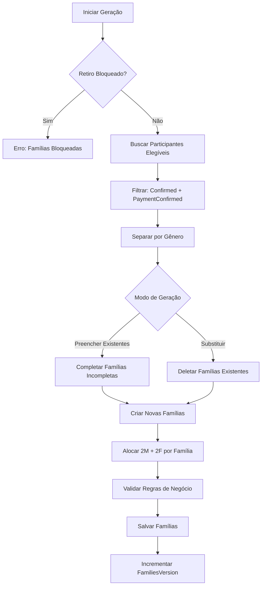
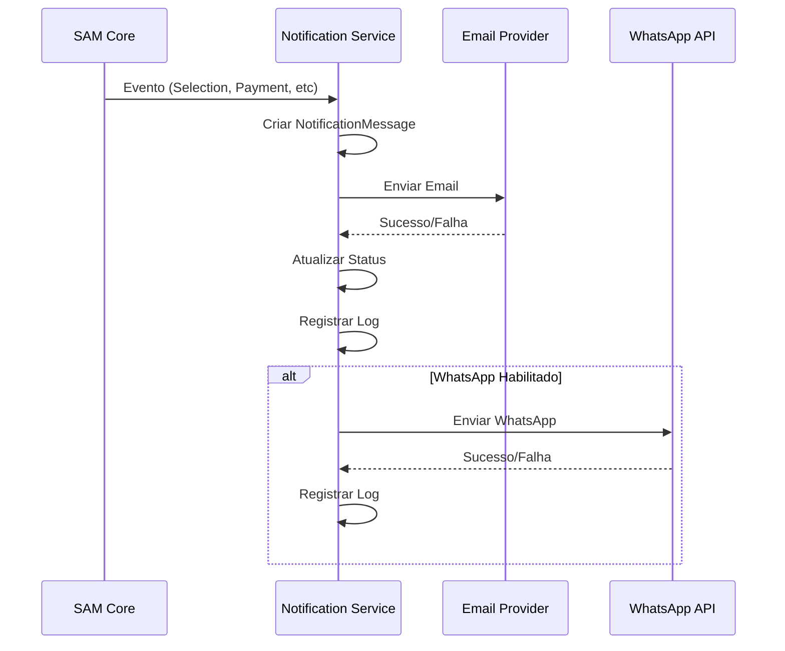
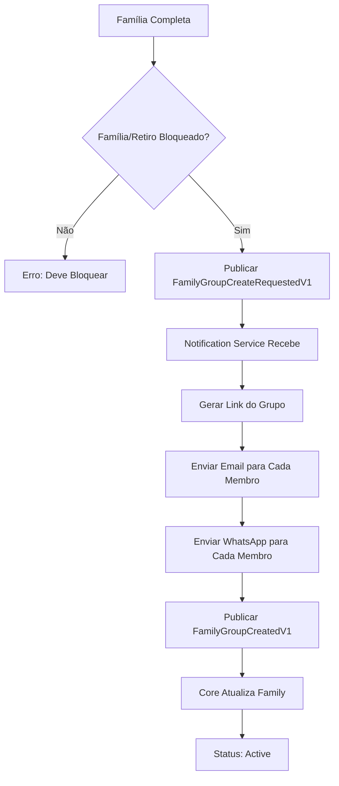
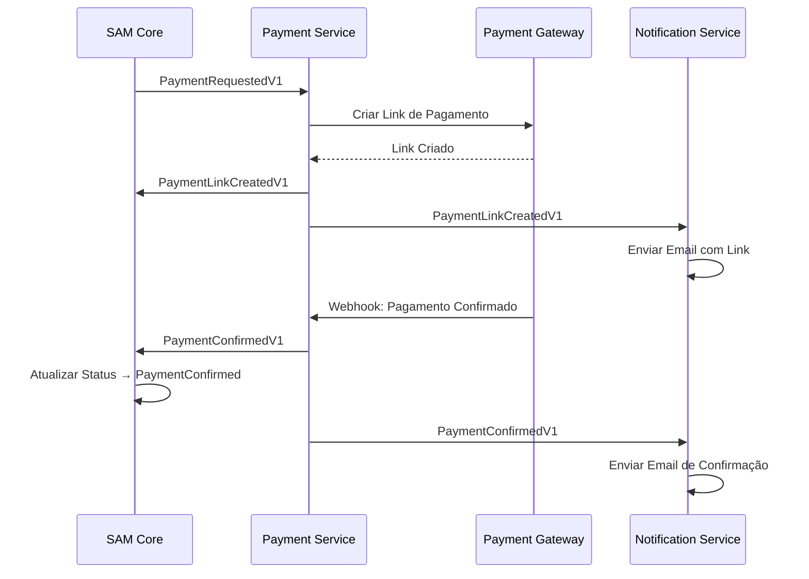
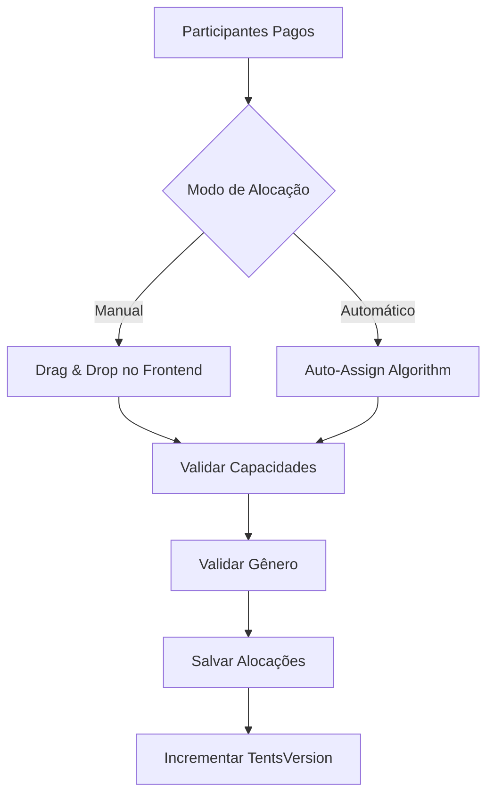
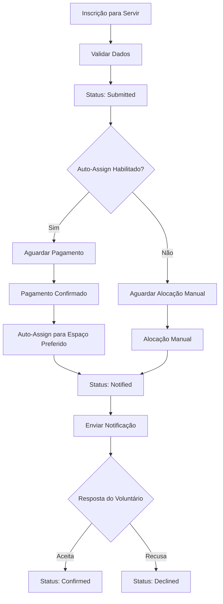
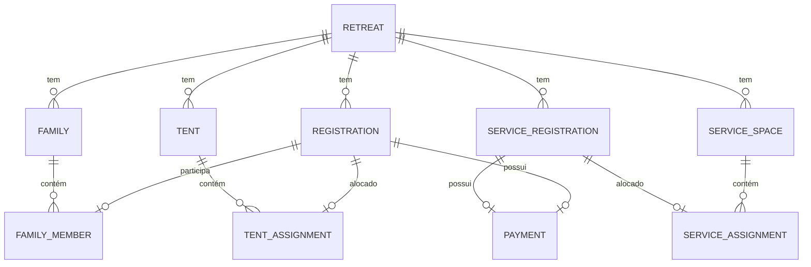
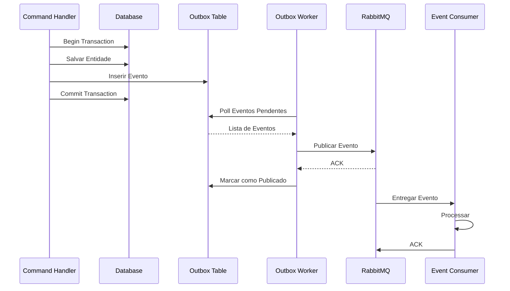
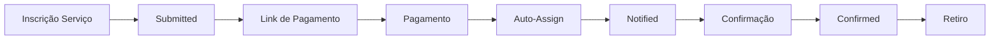

# SAMGestor - Sistema de Gestão de Retiros

## 🎯 Visão Geral do Sistema

O **SAMGestor** é um sistema completo de gestão de retiros espirituais que gerencia todo o ciclo de vida de um retiro, desde a inscrição dos participantes até a alocação em barracas e serviços. O sistema é construído com arquitetura de microserviços orientada a eventos, utilizando .NET 8, PostgreSQL e RabbitMQ.

### Principais Funcionalidades

- **Gestão de Inscrições**: Registro completo de participantes com validações de negócio
- **Sistema de Contemplação**: Sorteio aleatório com quotas regionais
- **Processamento de Pagamentos**: Integração com gateway de pagamento (fake/MercadoPago)
- **Geração de Famílias**: Criação automática de grupos de 4 pessoas (2H + 2M)
- **Gestão de Grupos**: Criação e notificação de grupos de WhatsApp/Email
- **Alocação em Barracas**: Distribuição automática por gênero e capacidade
- **Gestão de Serviços**: Alocação de equipe de serviço em espaços específicos

### Padrões Arquiteturais

- **Clean Architecture**: Separação clara entre domínio, aplicação e infraestrutura
- **CQRS**: Separação de comandos e consultas usando MediatR
- **Event-Driven Architecture**: Comunicação assíncrona via RabbitMQ
- **Outbox Pattern**: Garantia de entrega de eventos com transações
- **Repository Pattern**: Abstração de acesso a dados
- **Unit of Work**: Gerenciamento de transações

### Tecnologias Principais

- **.NET 8**: Framework principal
- **PostgreSQL**: Banco de dados relacional
- **RabbitMQ**: Message broker para eventos
- **Entity Framework Core**: ORM
- **FluentValidation**: Validação de comandos
- **MediatR**: Mediador para CQRS


### Visão Geral

O módulo de famílias agrupa participantes confirmados/pagos em grupos de 4 pessoas (2 homens + 2 mulheres) para convivência durante o retiro.

### Fluxo de Geração de Famílias



### Processo de Geração

#### 1. Criação Manual de Família

**Endpoint:** `POST /api/retreats/{id}/families`

**Validações:**
- Exatamente 4 membros
- Sem IDs duplicados
- Todos do mesmo retiro
- Todos habilitados (Enabled = true)
- Status: Confirmed ou PaymentConfirmed
- Nenhum já alocado em outra família
- Composição: 2 homens + 2 mulheres

**Alertas (Warnings):**
- `SAME_SURNAME`: Sobrenomes repetidos (ERRO no MVP)
- `SAME_CITY`: Múltiplos membros da mesma cidade (WARNING)

**Comportamento:**
- Se houver warnings e `IgnoreWarnings=false`, retorna sem criar
- Se `IgnoreWarnings=true`, cria mesmo com warnings
- Nome auto-gerado se não fornecido: "Família N"

#### 2. Geração Automática

**Endpoint:** `POST /api/retreats/{id}/families/generate`

**Parâmetros:**
- `Capacity`: Tamanho da família (padrão: 4)
- `ReplaceExisting`: Substituir famílias existentes (padrão: true)
- `FillExistingFirst`: Preencher incompletas antes de criar novas (padrão: false)

**Algoritmo:**

```csharp
// 1. Pool de elegíveis
var pool = Confirmed + PaymentConfirmed
    .Where(r => r.Enabled)
    .Where(r => !AlreadyAssigned);

// 2. Separar por gênero
var males = pool.Where(r => r.Gender == Male).ToList();
var females = pool.Where(r => r.Gender == Female).ToList();

// 3. Se FillExistingFirst, completar famílias incompletas
foreach (var family in existingFamilies.Where(f => !f.IsLocked))
{
    while (family.MaleCount < 2 && males.Any())
        AddToFamily(family, males.RemoveFirst());

    while (family.FemaleCount < 2 && females.Any())
        AddToFamily(family, females.RemoveFirst());
}

// 4. Criar novas famílias
var familiesCount = Min(males.Count / 2, females.Count / 2);
for (int i = 1; i <= familiesCount; i++)
{
    var family = new Family($"Família {i}", retreatId, capacity);

    // Adicionar 2 homens
    for (int k = 0; k < 2; k++)
        AddToFamily(family, males.RemoveFirst());

    // Adicionar 2 mulheres
    for (int k = 0; k < 2; k++)
        AddToFamily(family, females.RemoveFirst());
}
```

### Entidades

#### Family
```csharp
public class Family : Entity<Guid>
{
    public FamilyName Name { get; private set; }
    public Guid RetreatId { get; private set; }
    public int Capacity { get; private set; }
    public bool IsLocked { get; private set; }
    public bool IsComplete => Members.Count >= Capacity;

    // Grupo de WhatsApp/Telegram
    public string? GroupLink { get; private set; }
    public string? GroupExternalId { get; private set; }
    public DateTimeOffset? GroupCreatedAt { get; private set; }
    public string? GroupChannel { get; private set; }
    public GroupStatus GroupStatus { get; private set; }
    public int GroupVersion { get; private set; }

    public IReadOnlyCollection<FamilyMember> Members { get; }

    public void Lock();
    public void Unlock();
    public void SetGroup(string link, string? externalId, string channel, DateTimeOffset now);
    public void MarkGroupCreating();
    public void MarkGroupActive(...);
    public void MarkGroupFailed();
}
```

#### FamilyMember
```csharp
public class FamilyMember : Entity<Guid>
{
    public Guid RetreatId { get; private set; }
    public Guid FamilyId { get; private set; }
    public Guid RegistrationId { get; private set; }
    public int Position { get; private set; } // Ordem visual
    public DateTime AssignedAt { get; private set; }

    public void SetPosition(int position);
}
```

### Regras de Negócio

| Regra | Descrição |
|-------|-----------|
| **RN301** | Família deve ter exatamente 4 membros (2M + 2F) |
| **RN302** | Sobrenomes repetidos na mesma família são proibidos (MVP) |
| **RN303** | Membros devem estar Confirmed ou PaymentConfirmed |
| **RN304** | Membros devem estar habilitados (Enabled = true) |
| **RN305** | Membro não pode estar em múltiplas famílias |
| **RN306** | Famílias bloqueadas não podem ser editadas |
| **RN307** | Retiro bloqueado impede criação/edição de famílias |
| **RN308** | Cidade repetida gera warning mas não impede criação |

### Alertas de Validação

```csharp
public record CreateFamilyWarningDto(
    string Severity,      // "warning" ou "error"
    string Code,          // "SAME_SURNAME", "SAME_CITY"
    string Message,
    List<Guid> RegistrationIds
);
```

### Versionamento

Cada alteração em famílias incrementa `Retreat.FamiliesVersion`:
- Criação de família
- Edição de membros
- Bloqueio/desbloqueio
- Criação de grupo

Isso permite sincronização otimista no frontend.

---

## 💳 Processamento de Pagamentos

## 📢 Notificações e Gestão de Grupos

### Visão Geral

O sistema de notificações é um microserviço independente que gerencia:
- Envio de emails
- Envio de WhatsApp (preparado)
- Criação de grupos de família
- Rastreamento de entregas

### Fluxo de Notificações



### Eventos que Disparam Notificações

| Evento | Destinatário | Canal | Template |
|--------|--------------|-------|----------|
| `SelectionParticipantSelectedV1` | Participante contemplado | Email | selection-notification |
| `PaymentLinkCreatedV1` | Participante contemplado | Email | participant-payment-link |
| `PaymentConfirmedV1` | Participante | Email | payment-confirmed |
| `FamilyGroupCreateRequestedV1` | Membros da família | Email + WhatsApp | family-group-link |
| `ServingParticipantSelectedV1` | Voluntário de serviço | Email | serving-selection |

### Criação de Grupos de Família

#### Fluxo Completo



#### Processo Detalhado

1. **Requisição de Criação**
   - Endpoint: `POST /api/retreats/{id}/families/{familyId}/notify`
   - Validações:
     - Família completa (4 membros)
     - Retiro ou família bloqueada
     - Se já existe grupo e `ForceRecreate=false`, retorna existente

2. **Publicação de Evento**
   ```csharp
   var evt = new FamilyGroupCreateRequestedV1(
       RetreatId: retreatId,
       FamilyId: familyId,
       ForceRecreate: forceRecreate,
       Members: contacts // Nome, Email, Phone de cada membro
   );
   ```

3. **Processamento no Notification Service**
   - Gera link do grupo (fake ou API real)
   - Renderiza templates de email/WhatsApp
   - Envia para cada membro (deduplicado por email/phone)
   - Registra cada envio

4. **Confirmação**
   - Publica `FamilyGroupCreatedV1`
   - Core atualiza `Family.GroupStatus = Active`
   - Armazena link, canal, data de criação

#### Criação em Lote

**Endpoint:** `POST /api/retreats/{id}/families/groups/create`

**Parâmetros:**
- `OnlyComplete`: Apenas famílias completas (padrão: true)
- `OnlyLocked`: Apenas famílias bloqueadas (padrão: false)
- `ForceRecreate`: Recriar grupos existentes (padrão: false)
- `DryRun`: Simular sem executar (padrão: false)

**Comportamento:**
- Filtra famílias elegíveis
- Publica evento para cada família
- Retorna contadores: Total, Queued, Skipped

### Entidades de Notificação

#### NotificationMessage
```csharp
public class NotificationMessage : Entity<Guid>
{
    public NotificationChannel Channel { get; private set; } // Email, WhatsApp, SMS
    public string RecipientName { get; private set; }
    public string? RecipientEmail { get; private set; }
    public string? RecipientPhone { get; private set; }
    public string TemplateKey { get; private set; }
    public string Subject { get; private set; }
    public string Body { get; private set; }
    public NotificationStatus Status { get; private set; }
    public Guid? RegistrationId { get; private set; }
    public Guid? RetreatId { get; private set; }
    public string? ExternalCorrelationId { get; private set; }

    public void MarkSent();
    public void MarkFailed(string reason);
}
```

#### NotificationDispatchLog
```csharp
public class NotificationDispatchLog : Entity<Guid>
{
    public Guid NotificationMessageId { get; private set; }
    public NotificationStatus Status { get; private set; }
    public string? ErrorMessage { get; private set; }
    public DateTimeOffset CreatedAt { get; private set; }
}
```

#### SelectedRegistration
```csharp
public class SelectedRegistration : Entity<Guid>
{
    public Guid RegistrationId { get; private set; }
    public Guid RetreatId { get; private set; }
    public SelectionKind Kind { get; private set; } // Selection, Serving
    public string Name { get; private set; }
    public string Email { get; private set; }
    public string? Phone { get; private set; }
    public decimal Amount { get; private set; }
    public string Currency { get; private set; }
}
```

### Templates de Notificação

O sistema usa templates simples com placeholders:

```
Olá {{Name}},

Você foi contemplado para o retiro!

Valor: {{Amount}} {{Currency}}
Link de pagamento: {{LinkUrl}}

Qualquer dúvida, responda este e-mail.
```

**Renderer:**
```csharp
public interface ITemplateRenderer
{
    string Render(string template, Dictionary<string, string> data);
}
```

### Regras de Negócio

| Regra | Descrição |
|-------|-----------|
| **RN401** | Notificações são idempotentes por RegistrationId + EventType |
| **RN402** | Emails duplicados são enviados apenas uma vez por evento |
| **RN403** | WhatsApp duplicados são enviados apenas uma vez por evento |
| **RN404** | Falhas de envio são registradas mas não bloqueiam o fluxo |
| **RN405** | Grupos só podem ser criados para famílias completas |
| **RN406** | Família ou retiro deve estar bloqueado para criar grupo |

---


### Arquitetura de Pagamentos

O sistema de pagamentos opera como um microserviço independente que se comunica via eventos.



### Fluxo de Pagamento para Participantes Contemplados

1. **Solicitação de Pagamento**
   - Participante é selecionado (status `Selected`)
   - Sistema publica evento `PaymentRequestedV1`

2. **Criação do Link**
   - Payment Service recebe evento
   - Cria registro de pagamento (status: `Pending`)
   - Gera link de pagamento (fake ou MercadoPago)
   - Atualiza status para `LinkCreated`
   - Publica `PaymentLinkCreatedV1`

3. **Notificação do Link**
   - Notification Service recebe evento
   - Envia email com link de pagamento
   - Registra envio

4. **Confirmação de Pagamento**
   - Gateway notifica via webhook (ou link fake)
   - Payment Service marca como `Paid`
   - Publica `PaymentConfirmedV1`

5. **Atualização no Core**
   - Core recebe `PaymentConfirmedV1`
   - Cria/atualiza registro de Payment
   - Atualiza Registration para `PaymentConfirmed` ou `Confirmed`

### Entidades de Pagamento

#### Core: Payment
```csharp
public class Payment : Entity<Guid>
{
    public Guid RegistrationId { get; private set; }
    public Money Amount { get; private set; }
    public PaymentMethod Method { get; private set; }
    public PaymentStatus Status { get; private set; }
    public DateTime? PaidAt { get; private set; }

    public void MarkAsPaid();
    public void Cancel();
}
```

#### Payment Service: Payment
```csharp
public class Payment
{
    public Guid RegistrationId { get; private set; }
    public Guid RetreatId { get; private set; }
    public decimal Amount { get; private set; }
    public string Currency { get; private set; }
    public string Provider { get; private set; } // "fake" ou "mercadopago"
    public string? LinkUrl { get; private set; }
    public PaymentStatus Status { get; private set; }

    public void SetLink(string linkUrl, string? preferenceId, DateTimeOffset? expiresAt);
    public void MarkPaid(string providerPaymentId, DateTimeOffset paidAt);
}
```

### Status de Pagamento

#### Payment Service
```
Pending → LinkCreated → Paid
                     ↓
                   Failed
                     ↓
                   Expired
```

#### Core (Registration)
```
Selected → PendingPayment → PaymentConfirmed → Confirmed
```

### Transições de Status

| Evento | Status Anterior | Status Novo | Observações |
|--------|----------------|-------------|-------------|
| PaymentLinkCreated | Selected | PendingPayment | Link enviado ao participante |
| PaymentConfirmed | PendingPayment | PaymentConfirmed | Pagamento confirmado pelo gateway |
| Manual Confirmation | PaymentConfirmed | Confirmed | Confirmação manual pela equipe |

### Regras de Negócio

| Regra | Descrição |
|-------|-----------|
| **RN201** | Apenas participantes Selected podem receber link de pagamento |
| **RN202** | Link de pagamento é único por inscrição |
| **RN203** | Pagamento confirmado não pode ser revertido |
| **RN204** | Idempotência: múltiplas confirmações do mesmo pagamento são ignoradas |
| **RN205** | Status Confirmed não é rebaixado para PaymentConfirmed |

### Fake Payment Gateway

Para testes, o sistema inclui um gateway fake:

**Endpoints:**
- `GET /fake/confirm/{paymentId}?method=pix` - Confirma pagamento direto
- `GET /fake/checkout/{paymentId}` - Tela de checkout simulada
- `POST /fake/checkout/{paymentId}/pay?method=pix` - Processa pagamento

**Comportamento:**
- Marca pagamento como `Paid` imediatamente
- Publica evento `PaymentConfirmedV1`
- Idempotente: pode ser chamado múltiplas vezes

---

## 🏕️ Alocação em Tendas/Barracas

### Visão Geral

O módulo de tendas distribui participantes pagos/confirmados em barracas separadas por gênero, respeitando capacidades.

### Fluxo de Alocação



### Entidades

#### Tent
```csharp
public class Tent : Entity<Guid>
{
    public TentNumber Number { get; private set; }
    public TentCategory Category { get; private set; } // Male, Female
    public int Capacity { get; private set; }
    public Guid RetreatId { get; private set; }
    public bool IsActive { get; private set; }
    public bool IsLocked { get; private set; }
    public string? Notes { get; private set; }

    public void Lock();
    public void Unlock();
    public void UpdateCapacity(int capacity);
}
```

#### TentAssignment
```csharp
public class TentAssignment : Entity<Guid>
{
    public Guid TentId { get; private set; }
    public Guid RegistrationId { get; private set; }
    public int? Position { get; private set; } // Ordem visual
    public DateTime AssignedAt { get; private set; }
}
```

### Alocação Automática

**Endpoint:** `POST /api/retreats/{id}/tents/roster/auto-assign`

**Parâmetros:**
- `RespectLocked`: Não mexer em barracas travadas (padrão: true)

**Algoritmo:**

```csharp
// 1. Buscar participantes elegíveis não alocados
var poolMale = ListPaidUnassigned(retreatId, Gender.Male);
var poolFemale = ListPaidUnassigned(retreatId, Gender.Female);

// 2. Calcular vagas restantes por barraca
var remaining = tents.ToDictionary(
    t => t.Id,
    t => Max(0, t.Capacity - CurrentOccupancy(t.Id))
);

// 3. Ordenar barracas por ocupação (menor primeiro)
var orderedTents = tents
    .OrderBy(t => CurrentOccupancy(t.Id))
    .ThenBy(t => t.Number);

// 4. Alocar sequencialmente
foreach (var participant in pool)
{
    var targetTent = orderedTents
        .FirstOrDefault(t =>
            t.Category == participant.Gender &&
            remaining[t.Id] > 0
        );

    if (targetTent != null)
    {
        Assign(targetTent, participant);
        remaining[targetTent.Id]--;

        // Reordenar para manter distribuição equilibrada
        orderedTents = orderedTents
            .OrderBy(t => CurrentOccupancy(t.Id))
            .ThenBy(t => t.Number);
    }
}
```

### Alocação Manual

**Endpoint:** `PUT /api/retreats/{id}/tents/roster`

**Payload:**
```json
{
  "version": 5,
  "tents": [
    {
      "tentId": "guid",
      "members": [
        {
          "registrationId": "guid",
          "position": 0
        }
      ]
    }
  ]
}
```

**Validações:**
- Versão otimista (evita conflitos)
- Barracas bloqueadas não podem ser editadas
- Capacidade não pode ser excedida
- Gênero deve corresponder à categoria da barraca
- Participante deve estar pago/confirmado

### Regras de Negócio

| Regra | Descrição |
|-------|-----------|
| **RN501** | Barracas são separadas por gênero (Male/Female) |
| **RN502** | Capacidade máxima não pode ser excedida |
| **RN503** | Apenas participantes PaymentConfirmed ou Confirmed podem ser alocados |
| **RN504** | Participante não pode estar em múltiplas barracas |
| **RN505** | Barracas bloqueadas não podem ser editadas |
| **RN506** | Retiro bloqueado impede edições |
| **RN507** | Auto-assign distribui equilibradamente (menor ocupação primeiro) |

### Versionamento

Cada alteração incrementa `Retreat.TentsVersion`:
- Criação/edição de barraca
- Alocação/remoção de participante
- Bloqueio/desbloqueio

---


## 🙏 Módulo de Serviço - Fluxo Completo

### Visão Geral

O módulo de serviço gerencia a equipe de voluntários que trabalharão em diferentes espaços durante o retiro (cozinha, limpeza, coordenação, etc.).

### Fluxo Completo de Serviço



### Entidades

#### ServiceSpace
```csharp
public class ServiceSpace : Entity<Guid>
{
    public string Name { get; private set; }
    public int MinPeople { get; private set; }
    public int MaxPeople { get; private set; }
    public Guid RetreatId { get; private set; }
    public bool IsActive { get; private set; }
    public bool IsLocked { get; private set; }
    public string? Description { get; private set; }

    public void UpdateCapacity(int min, int max);
    public void Lock();
    public void Unlock();
}
```

#### ServiceRegistration
```csharp
public class ServiceRegistration : Entity<Guid>
{
    public FullName Name { get; private set; }
    public CPF Cpf { get; private set; }
    public EmailAddress Email { get; private set; }
    public string Phone { get; private set; }
    public DateOnly BirthDate { get; private set; }
    public Gender Gender { get; private set; }
    public string City { get; private set; }
    public Guid RetreatId { get; private set; }
    public Guid? PreferredSpaceId { get; private set; }
    public ServiceRegistrationStatus Status { get; private set; }
    public bool Enabled { get; private set; }
    public DateTime RegistrationDate { get; private set; }

    // Dados adicionais similares a Registration
    // (saúde, família, espirituais, etc.)

    public void SetStatus(ServiceRegistrationStatus newStatus);
    public void Disable();
}
```

#### ServiceAssignment
```csharp
public class ServiceAssignment : Entity<Guid>
{
    public Guid ServiceSpaceId { get; private set; }
    public Guid ServiceRegistrationId { get; private set; }
    public ServiceRole Role { get; private set; } // Member, Vice, Coordinator
    public DateTime AssignedAt { get; private set; }

    public void SetRole(ServiceRole role);
}
```

### Processo de Inscrição

**Endpoint:** `POST /api/service/registrations`

**Validações:**
- CPF único por retiro
- Email único por retiro
- Espaço preferido deve estar ativo
- Dados pessoais completos

**Comportamento:**
- Status inicial: `Submitted`
- Enabled: `true`
- Armazena espaço preferido (opcional)

### Alocação de Serviço

#### 1. Alocação Automática (Pós-Pagamento)

Quando habilitado, ao confirmar pagamento:

```csharp
// Evento: ServicePaymentConfirmedV1
if (autoAssignEnabled && preferredSpace != null)
{
    if (!preferredSpace.IsLocked &&
        CurrentOccupancy(preferredSpace) < preferredSpace.MaxPeople)
    {
        var assignment = new ServiceAssignment(
            preferredSpace.Id,
            registration.Id,
            ServiceRole.Member
        );

        registration.SetStatus(ServiceRegistrationStatus.Notified);
        PublishEvent(new ServingParticipantSelectedV1(...));
    }
}
```

#### 2. Alocação Manual

**Endpoint:** `PUT /api/retreats/{id}/service/roster`

**Payload:**
```json
{
  "version": 3,
  "spaces": [
    {
      "spaceId": "guid",
      "members": [
        {
          "registrationId": "guid",
          "role": "Coordinator"
        }
      ]
    }
  ]
}
```

**Validações:**
- Versão otimista
- Espaço não pode estar bloqueado
- Capacidade máxima respeitada
- Apenas um Coordinator por espaço
- Apenas um Vice por espaço
- Participante deve estar pago/confirmado

### Status de Serviço

```
Submitted → Notified → Confirmed
                    ↓
                 Declined
                    ↓
                 Cancelled
```

### Alertas de Serviço

O sistema gera alertas automáticos para espaços:

**Endpoint:** `GET /api/retreats/{id}/service/alerts`

**Tipos de Alerta:**

| Código | Severidade | Descrição |
|--------|-----------|-----------|
| `BELOW_MIN` | Warning | Menos pessoas que o mínimo |
| `OVER_MAX` | Error | Mais pessoas que o máximo |
| `MISSING_COORDINATOR` | Warning | Sem coordenador |
| `MISSING_VICE` | Info | Sem vice-coordenador |
| `HIGH_PREFERENCES` | Info | Muitas preferências não atendidas |

**Algoritmo:**

```csharp
foreach (var space in spaces)
{
    var assigned = CountAssigned(space.Id);
    var preferences = CountPreferences(space.Id);
    var coordinator = HasRole(space.Id, ServiceRole.Coordinator);
    var vice = HasRole(space.Id, ServiceRole.Vice);

    if (assigned < space.MinPeople)
        alerts.Add(new Alert("BELOW_MIN", "Warning", ...));

    if (assigned > space.MaxPeople)
        alerts.Add(new Alert("OVER_MAX", "Error", ...));

    if (!coordinator)
        alerts.Add(new Alert("MISSING_COORDINATOR", "Warning", ...));

    if (!vice)
        alerts.Add(new Alert("MISSING_VICE", "Info", ...));

    if (preferences > assigned * 1.5)
        alerts.Add(new Alert("HIGH_PREFERENCES", "Info", ...));
}
```

### Regras de Negócio

| Regra | Descrição |
|-------|-----------|
| **RN601** | CPF e Email devem ser únicos por retiro |
| **RN602** | Espaço preferido é opcional mas deve estar ativo |
| **RN603** | Capacidade mínima e máxima são validadas |
| **RN604** | Apenas um Coordinator por espaço |
| **RN605** | Apenas um Vice por espaço |
| **RN606** | Espaços bloqueados não podem ser editados |
| **RN607** | Auto-assign respeita locks e capacidades |
| **RN608** | Participante não pode estar em múltiplos espaços |

### Versionamento

Cada alteração incrementa `Retreat.ServiceSpacesVersion`:
- Criação/edição de espaço
- Alocação/remoção de voluntário
- Mudança de papel (role)
- Bloqueio/desbloqueio

---


## 📊 Modelos de Dados e Relacionamentos

### Diagrama de Entidades Principais



### Entidade Central: Retreat

```csharp
public class Retreat : Entity<Guid>
{
    // Identificação
    public FullName Name { get; private set; }
    public string Edition { get; private set; }
    public string Theme { get; private set; }

    // Datas
    public DateOnly StartDate { get; private set; }
    public DateOnly EndDate { get; private set; }
    public DateOnly RegistrationStart { get; private set; }
    public DateOnly RegistrationEnd { get; private set; }

    // Capacidades
    public int MaleSlots { get; private set; }
    public int FemaleSlots { get; private set; }
    public int TotalSlots => MaleSlots + FemaleSlots;

    // Valores
    public Money FeeFazer { get; private set; }
    public Money FeeServir { get; private set; }

    // Quotas Regionais
    public Percentage WestRegionPercentage { get; private set; }
    public Percentage OtherRegionsPercentage { get; private set; }

    // Controles de Versão e Bloqueio
    public int FamiliesVersion { get; private set; }
    public bool FamiliesLocked { get; private set; }
    public bool ContemplationClosed { get; private set; }
    public int ServiceSpacesVersion { get; private set; }
    public bool ServiceLocked { get; private set; }
    public int TentsVersion { get; private set; }
    public bool TentsLocked { get; private set; }

    // Política de Privacidade
    public string? PrivacyPolicyTitle { get; private set; }
    public string? PrivacyPolicyBody { get; private set; }
    public string? PrivacyPolicyVersion { get; private set; }
}
```

### Value Objects

#### FullName
```csharp
public class FullName : ValueObject
{
    public string Value { get; private set; }

    // Validação: mínimo 2 palavras
    // Normalização: Trim, Title Case
}
```

#### CPF
```csharp
public class CPF : ValueObject
{
    public string Value { get; private set; }

    // Validação: 11 dígitos, algoritmo de validação
    // Normalização: apenas números
}
```

#### EmailAddress
```csharp
public class EmailAddress : ValueObject
{
    public string Value { get; private set; }

    // Validação: formato de email
    // Normalização: lowercase
}
```

#### Money
```csharp
public class Money : ValueObject
{
    public decimal Amount { get; private set; }
    public string Currency { get; private set; }

    // Operações: Add, Subtract, Multiply
}
```

#### Percentage
```csharp
public class Percentage : ValueObject
{
    public decimal Value { get; private set; }

    // Validação: 0-100
}
```

### Enumerações

#### RegistrationStatus
```csharp
public enum RegistrationStatus
{
    NotSelected,      // Inscrito, aguardando sorteio
    Selected,         // Contemplado, aguardando link de pagamento
    PendingPayment,   // Link de pagamento enviado
    PaymentConfirmed, // Pagamento confirmado
    Confirmed,        // Confirmado manualmente pela equipe
    Canceled          // Cancelado
}
```

#### PaymentStatus
```csharp
public enum PaymentStatus
{
    Pending,      // Aguardando criação do link
    LinkCreated,  // Link criado e enviado
    Paid,         // Pago
    Failed,       // Falha no pagamento
    Expired       // Link expirado
}
```

#### ServiceRegistrationStatus
```csharp
public enum ServiceRegistrationStatus
{
    Submitted,  // Inscrito
    Notified,   // Notificado da alocação
    Confirmed,  // Confirmou participação
    Declined,   // Recusou participação
    Cancelled   // Cancelado
}
```

#### GroupStatus
```csharp
public enum GroupStatus
{
    None,      // Sem grupo
    Creating,  // Criando grupo
    Active,    // Grupo ativo
    Failed     // Falha na criação
}
```

### Relacionamentos e Cardinalidades

| Entidade Pai | Relacionamento | Entidade Filha | Cardinalidade |
|--------------|----------------|----------------|---------------|
| Retreat | tem | Registration | 1:N |
| Retreat | tem | Family | 1:N |
| Retreat | tem | Tent | 1:N |
| Retreat | tem | ServiceSpace | 1:N |
| Retreat | tem | ServiceRegistration | 1:N |
| Registration | possui | Payment | 1:0..1 |
| Registration | participa | FamilyMember | 1:0..1 |
| Registration | alocado | TentAssignment | 1:0..1 |
| Family | contém | FamilyMember | 1:4 |
| Tent | contém | TentAssignment | 1:N |
| ServiceSpace | contém | ServiceAssignment | 1:N |
| ServiceRegistration | alocado | ServiceAssignment | 1:0..1 |

---


## 🔄 Sistema de Eventos e Mensageria

### Arquitetura de Eventos

O SAMGestor utiliza uma arquitetura orientada a eventos para comunicação entre microserviços, garantindo:
- **Desacoplamento**: Serviços não se conhecem diretamente
- **Escalabilidade**: Processamento assíncrono
- **Confiabilidade**: Outbox Pattern para garantia de entrega
- **Rastreabilidade**: Todos os eventos são registrados

### Outbox Pattern



### Catálogo de Eventos

#### Eventos de Seleção/Contemplação

**`selection.participant.selected.v1`**
```json
{
  "registrationId": "guid",
  "retreatId": "guid",
  "name": "string",
  "email": "string",
  "phone": "string",
  "amount": 150.00,
  "currency": "BRL"
}
```
- **Publicado por**: SAM Core (após sorteio ou seleção manual)
- **Consumido por**: Notification Service
- **Ação**: Envia email de contemplação

**`selection.participant.selected.v2`**
```json
{
  "registrationId": "guid",
  "retreatId": "guid",
  "name": "string",
  "email": "string",
  "phone": "string",
  "amount": 150.00,
  "currency": "BRL",
  "selectionDate": "2025-01-15T10:30:00Z"
}
```
- **Diferença da v1**: Adiciona `selectionDate`

#### Eventos de Pagamento

**`payment.requested.v1`**
```json
{
  "registrationId": "guid",
  "retreatId": "guid",
  "amount": 150.00,
  "currency": "BRL",
  "provider": "fake"
}
```
- **Publicado por**: SAM Core
- **Consumido por**: Payment Service
- **Ação**: Cria link de pagamento

**`payment.link.created.v1`**
```json
{
  "paymentId": "guid",
  "registrationId": "guid",
  "retreatId": "guid",
  "linkUrl": "https://...",
  "expiresAt": "2025-01-20T23:59:59Z"
}
```
- **Publicado por**: Payment Service
- **Consumido por**: SAM Core, Notification Service
- **Ação**: Atualiza status, envia email com link

**`payment.confirmed.v1`**
```json
{
  "paymentId": "guid",
  "registrationId": "guid",
  "retreatId": "guid",
  "amount": 150.00,
  "currency": "BRL",
  "paidAt": "2025-01-16T14:22:00Z",
  "method": "pix"
}
```
- **Publicado por**: Payment Service
- **Consumido por**: SAM Core, Notification Service
- **Ação**: Atualiza status para PaymentConfirmed, envia confirmação

#### Eventos de Família

**`family.group.create.requested.v1`**
```json
{
  "retreatId": "guid",
  "familyId": "guid",
  "familyName": "Família 1",
  "forceRecreate": false,
  "members": [
    {
      "registrationId": "guid",
      "name": "João Silva",
      "email": "joao@example.com",
      "phone": "+5511999999999"
    }
  ]
}
```
- **Publicado por**: SAM Core
- **Consumido por**: Notification Service
- **Ação**: Cria grupo e envia convites

**`family.group.created.v1`**
```json
{
  "retreatId": "guid",
  "familyId": "guid",
  "groupLink": "https://chat.whatsapp.com/...",
  "groupExternalId": "120363...",
  "channel": "whatsapp",
  "createdAt": "2025-01-17T09:00:00Z"
}
```
- **Publicado por**: Notification Service
- **Consumido por**: SAM Core
- **Ação**: Atualiza Family com informações do grupo

**`family.group.create.failed.v1`**
```json
{
  "retreatId": "guid",
  "familyId": "guid",
  "reason": "API timeout",
  "failedAt": "2025-01-17T09:05:00Z"
}
```
- **Publicado por**: Notification Service
- **Consumido por**: SAM Core
- **Ação**: Marca grupo como Failed

**`family.group.notify.requested.v1`**
```json
{
  "retreatId": "guid",
  "familyId": "guid",
  "groupLink": "https://...",
  "members": [...]
}
```
- **Publicado por**: SAM Core
- **Consumido por**: Notification Service
- **Ação**: Envia notificações com link do grupo

#### Eventos de Serviço

**`serving.participant.selected.v1`**
```json
{
  "serviceRegistrationId": "guid",
  "retreatId": "guid",
  "spaceId": "guid",
  "spaceName": "Cozinha",
  "name": "Maria Santos",
  "email": "maria@example.com",
  "phone": "+5511888888888",
  "role": "Member"
}
```
- **Publicado por**: SAM Core
- **Consumido por**: Notification Service
- **Ação**: Envia email de alocação em serviço

### Configuração do RabbitMQ

#### Exchanges
- **`sam.events`**: Exchange principal (tipo: topic)

#### Queues e Bindings

| Queue | Binding Key | Consumidor |
|-------|-------------|------------|
| `sam.notification.selection` | `selection.participant.selected.*` | Notification Service |
| `sam.notification.payment` | `payment.link.created.*` | Notification Service |
| `sam.notification.payment.confirmed` | `payment.confirmed.*` | Notification Service |
| `sam.notification.family` | `family.group.*` | Notification Service |
| `sam.notification.serving` | `serving.participant.selected.*` | Notification Service |
| `sam.payment.requests` | `payment.requested.*` | Payment Service |
| `sam.core.payment.links` | `payment.link.created.*` | SAM Core |
| `sam.core.payment.confirmed` | `payment.confirmed.*` | SAM Core |
| `sam.core.family.groups` | `family.group.created.*` | SAM Core |

### Garantias de Entrega

#### Outbox Worker

**Configuração:**
```json
{
  "Outbox": {
    "BatchSize": 50,
    "PollIntervalSeconds": 10,
    "UseListenNotify": false,
    "ListenChannel": "outbox_new",
    "WatchdogSeconds": 30
  }
}
```

**Comportamento:**
1. Poll a cada 10 segundos
2. Processa até 50 eventos por lote
3. Marca como publicado após ACK do RabbitMQ
4. Watchdog detecta workers travados

#### Idempotência

Todos os consumers implementam idempotência:
- **Chave de deduplicação**: `RegistrationId + EventType` ou `PaymentId`
- **Verificação**: Antes de processar, verifica se já foi processado
- **Registro**: Armazena hash do evento processado

### Tratamento de Erros

#### Retry Policy

```csharp
services.AddMassTransit(x =>
{
    x.AddConsumer<PaymentRequestedConsumer>();

    x.UsingRabbitMq((context, cfg) =>
    {
        cfg.UseMessageRetry(r => r.Intervals(
            TimeSpan.FromSeconds(5),
            TimeSpan.FromSeconds(15),
            TimeSpan.FromSeconds(30)
        ));

        cfg.UseDelayedRedelivery(r => r.Intervals(
            TimeSpan.FromMinutes(1),
            TimeSpan.FromMinutes(5),
            TimeSpan.FromMinutes(15)
        ));
    });
});
```

#### Dead Letter Queue

Após 3 tentativas de retry + 3 de delayed redelivery, eventos vão para:
- **Queue**: `sam.{service}.{queue}_error`
- **Monitoramento**: Alertas para equipe
- **Reprocessamento**: Manual via admin panel

### Monitoramento e Observabilidade

#### Logs Estruturados

```csharp
_logger.LogInformation(
    "Event published: {EventType} for Registration {RegistrationId}",
    eventType,
    registrationId
);
```

#### Métricas

- Total de eventos publicados
- Total de eventos consumidos
- Latência de processamento
- Taxa de erro por consumer
- Tamanho da fila de outbox

---

## 🎯 Fluxo Completo do Sistema

### Jornada do Participante (Fazer)

```mermaid
graph LR
    A[Inscrição] --> B[NotSelected]
    B --> C[Sorteio]
    C --> D[Selected]
    D --> E[Link de Pagamento]
    E --> F[PendingPayment]
    F --> G[Pagamento]
    G --> H[PaymentConfirmed]
    H --> I[Geração de Famílias]
    I --> J[Criação de Grupo]
    J --> K[Alocação em Barraca]
    K --> L[Retiro]
```



### Jornada do Voluntário (Servir)



### Transições de Status Consolidadas

#### Registration
```
NotSelected → Selected → PendingPayment → PaymentConfirmed → Confirmed
    ↓                                                             ↓
Canceled ←--------------------------------------------------→ Canceled
```

#### Payment
```
Pending → LinkCreated → Paid
              ↓
           Failed
              ↓
           Expired
```

#### Family.GroupStatus
```
None → Creating → Active
          ↓
       Failed
```

#### ServiceRegistration
```
Submitted → Notified → Confirmed
               ↓
            Declined
               ↓
            Cancelled
```

---

## 🚀 Executando o Sistema

### Pré-requisitos

- .NET 8 SDK
- Docker e Docker Compose
- PostgreSQL 15+
- RabbitMQ 3.12+

### Configuração Local

1. **Subir infraestrutura:**
   ```bash
   cd infra
   docker-compose up -d
   ```

2. **Configurar banco de dados:**
   ```bash
   cd src/SAMGestor.API
   dotnet ef database update
   ```

3. **Executar serviços:**
   ```bash
   # Terminal 1: Core API
   cd src/SAMGestor.API
   dotnet run

   # Terminal 2: Payment Service
   cd services/payment/src/SAMGestor.Payment.API
   dotnet run

   # Terminal 3: Notification Service
   cd services/notification/src/SAMGestor.Notification.API
   dotnet run
   ```

### Endpoints Principais

- **Core API**: `http://localhost:5000`
- **Payment Service**: `http://localhost:5001`
- **Notification Service**: `http://localhost:5002`
- **RabbitMQ Management**: `http://localhost:15672` (guest/guest)

---

## 📝 Considerações Finais

### Pontos Fortes

✅ **Arquitetura Limpa**: Separação clara de responsabilidades
✅ **Event-Driven**: Comunicação assíncrona e desacoplada
✅ **Outbox Pattern**: Garantia de entrega de eventos
✅ **Versionamento**: Controle de concorrência otimista
✅ **Validações Robustas**: FluentValidation + regras de domínio
✅ **Idempotência**: Processamento seguro de eventos duplicados

### Melhorias Futuras

🔄 **Quotas Regionais**: Implementar algoritmo de sorteio com quotas
🔄 **Saga Pattern**: Orquestração de transações distribuídas
🔄 **CQRS Completo**: Separar read models otimizados
🔄 **Event Sourcing**: Histórico completo de mudanças
🔄 **API Gateway**: Ponto único de entrada
🔄 **Autenticação/Autorização**: JWT + roles
🔄 **Testes E2E**: Cobertura completa de fluxos

---


